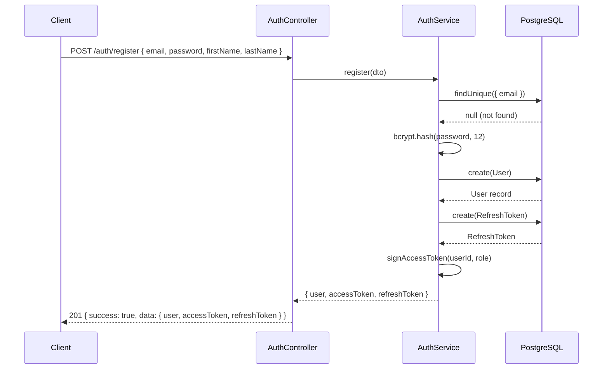
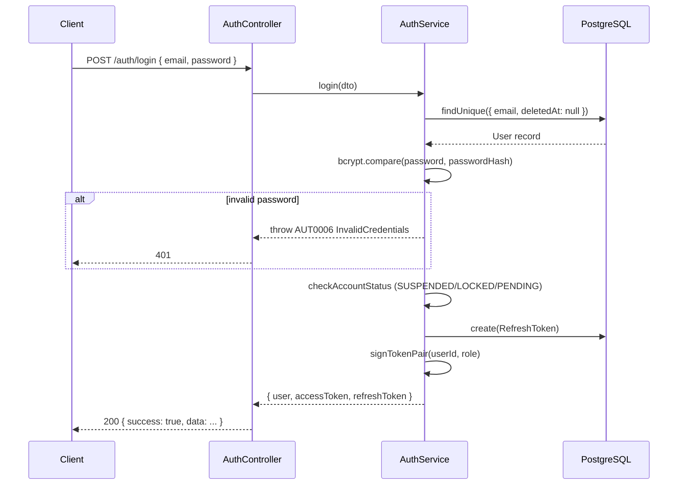
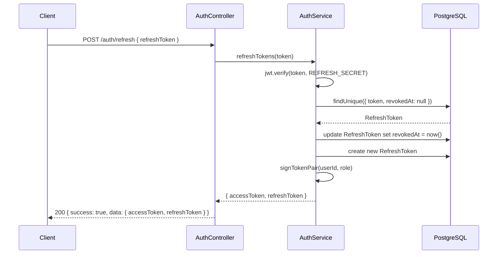
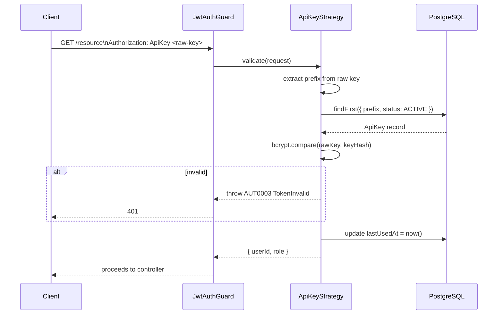

# Authentication Flow

## Overview

The application supports two authentication strategies:

1. **JWT** — access token (15 min) + refresh token (7 days, single-use rotation).
2. **API Key** — hashed key stored in `api_keys` table; validated on every request via `passport-custom`.

Both are handled by Passport strategies registered in `AuthModule`.
A global `JwtAuthGuard` protects all routes except those decorated with `@Public()`.

---

## Register Flow

---

## Login Flow

---

## Refresh Token Flow

---

## API Key Auth Flow

---

## Token Signing

| Token | Secret env var | Expiry env var | Default expiry |
|-------|---------------|----------------|----------------|
| Access | `JWT_ACCESS_SECRET` | `JWT_ACCESS_EXPIRATION` | `15m` |
| Refresh | `JWT_REFRESH_SECRET` | `JWT_REFRESH_EXPIRATION` | `7d` |

Both secrets must be at least 32 characters (`MIN_SECRET_LENGTH` constant).
See `src/config/schemas/env.schema.ts` for validation rules.
