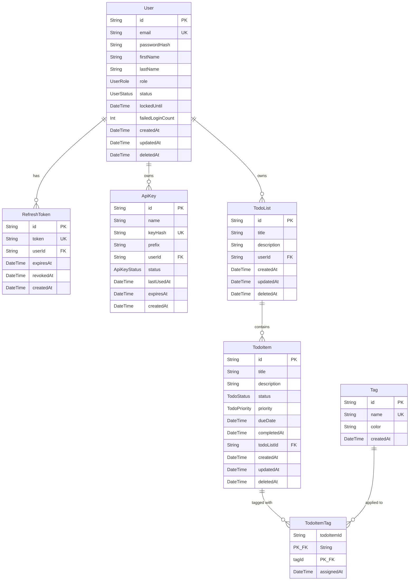

# Database Design

## ER Diagram

## Enums

| Enum | Values |
|------|--------|
| `UserStatus` | `ACTIVE`, `SUSPENDED`, `PENDING_VERIFICATION` |
| `UserRole` | `USER`, `ADMIN` |
| `ApiKeyStatus` | `ACTIVE`, `REVOKED` |
| `TodoStatus` | `PENDING`, `IN_PROGRESS`, `COMPLETED`, `ARCHIVED` |
| `TodoPriority` | `LOW`, `MEDIUM`, `HIGH`, `URGENT` |

## Soft Delete Strategy

`User`, `TodoList`, and `TodoItem` use a `deletedAt: DateTime?` column for soft deletes.
All queries **must** include `where: { deletedAt: null }` (or use the `BaseRepository` helpers
which apply this filter automatically).

Hard delete is only performed on `RefreshToken` and `ApiKey` cascade when a `User` is deleted.

## Indexes

| Table | Indexed Columns | Purpose |
|-------|----------------|---------|
| `refresh_tokens` | `userId` | Fast lookup of all tokens for a user on login/refresh |
| `api_keys` | `userId` | Fast lookup of all keys for a user |
| `todo_lists` | `userId` | List all lists for a user |
| `todo_items` | `todoListId` | List all items in a list |
| `todo_items` | `status` | Filter items by status |
| `todo_items` | `priority` | Filter items by priority |
| `todo_items` | `dueDate` | Sort/filter by due date |

## Cascade Rules

- `User` deleted → `RefreshToken`, `ApiKey`, `TodoList` cascade delete.
- `TodoList` deleted → `TodoItem` cascade delete.
- `TodoItem` deleted → `TodoItemTag` cascade delete.
- `Tag` deleted → `TodoItemTag` cascade delete.
