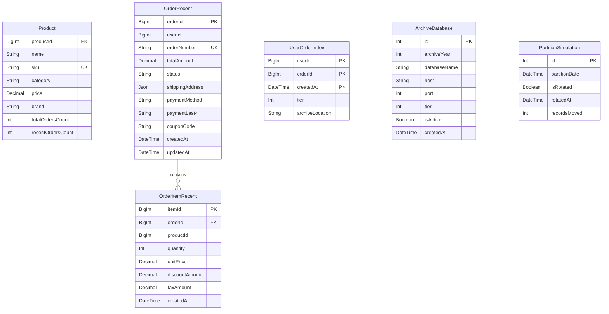

# Database Design

<!-- DOC-SYNC: Rewritten on 2026-04-25 for the Order Management pivot (feat/observability). Prisma schema now mirrors the order-management SQL tables; runtime queries use raw pg pools, not Prisma delegates. Please verify visual accuracy before committing. -->

## Schema Overview

Prisma is used **for schema migrations only**. Runtime queries execute via raw
`pg.Pool` instances managed by `MultiDbService`. The Prisma models in
`src/database/prisma/schema.prisma` mirror the primary DB tables.

## ER Diagram (Primary DB — Hot Tier)



## Multi-Tier Storage Model

| Tier | Name | DB                 | Pool method                          | Contents                        |
| ---- | ---- | ------------------ | ------------------------------------ | ------------------------------- |
| 2    | Hot  | Primary + replicas | `getPrimaryPool()` / `getReadPool()` | Recent orders (`orders_recent`) |
| 3    | Warm | Metadata archive   | `getMetadataPool()`                  | Orders 1–2 years old            |
| 4    | Cold | Per-year archives  | `getPoolForYear(year, 4)`            | Orders older than 2 years       |

`UserOrderIndex` (primary DB) is the global index across all tiers — it records
`(userId, orderId, createdAt, tier, archiveLocation)` so the application can
route a lookup to the correct pool without scanning all tiers.

`ArchiveDatabase` table (primary DB) drives `ArchiveRegistryService`: it maps
`(archiveYear, tier)` to a `(host, port, databaseName)` for cold-archive pool
creation.

## Indexes

| Table                | Indexed Columns            | Purpose                                     |
| -------------------- | -------------------------- | ------------------------------------------- |
| `orders_recent`      | `(userId, createdAt DESC)` | Per-user recent order listing               |
| `order_items_recent` | `orderId`                  | Item lookup by order                        |
| `user_order_index`   | `orderId`                  | Reverse lookup (which user owns this order) |

## Cascade Rules

- `OrderRecent` deleted → `OrderItemRecent` cascade delete (`onDelete: Cascade`).
- No other cascade rules in the primary schema.

## Soft Delete

No models in this schema use soft delete. Data lifecycle is managed by the
archival rotation pipeline (see `ArchivalModule` — full implementation in
`feat/om-archival`).

## Migration Workflow

```bash
# Create and apply a new migration in dev
npm run prisma:migrate:dev -- --name <description>

# Apply pending migrations in production
npm run prisma:migrate:deploy

# After schema change, regenerate Prisma Client
npm run prisma:generate
```

Never edit migration SQL files manually after they have been applied to any environment.
