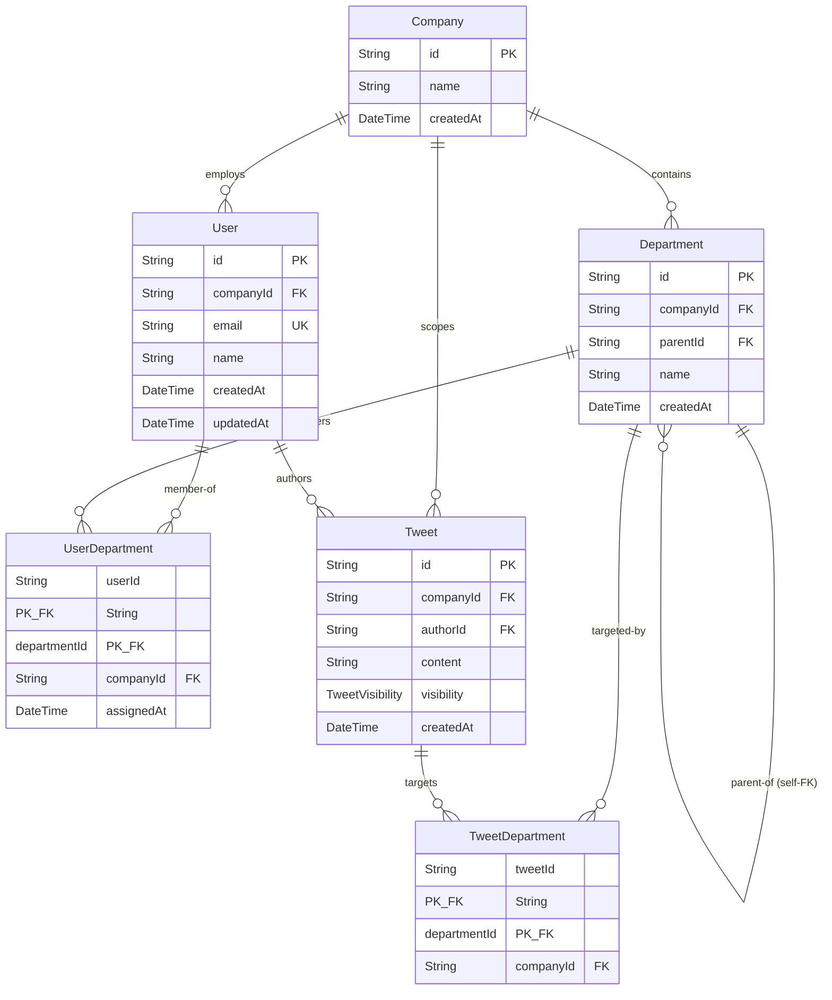

# Database Design

<!-- DOC-SYNC: Rewritten on 2026-04-17 for the Enterprise Twitter pivot. Please verify visual accuracy before committing. -->

## ER Diagram

## Enums

| Enum              | Values |
|-------------------|--------|
| `TweetVisibility` | `COMPANY`, `DEPARTMENTS`, `DEPARTMENTS_AND_SUBDEPARTMENTS` |

## Tenant-Scoped Models

These models carry a `companyId` column and are wrapped by the Prisma
tenant-scope extension (`src/database/extensions/tenant-scope.extension.ts`):

- `Department`
- `UserDepartment`
- `Tweet`
- `TweetDepartment`

`Company` and `User` are **not** tenant-scoped:
- `Company` **is** the tenant.
- `User` identity is resolved by `MockAuthMiddleware` **before** tenant
  context is established, so user lookup can't be gated on the very thing it's
  producing.

## Composite Unique Keys & Same-Tenant Foreign Keys

The schema makes cross-tenant references physically impossible:

- `Department @@unique([id, companyId])` — enables same-tenant composite FKs.
- `Department.parent` FK `(parentId, companyId) → departments(id, companyId)`
  — a department's parent must live in the same company.
- `Tweet @@unique([id, companyId])` — enables the pivot composite FK.
- `TweetDepartment.tweet` FK `(tweetId, companyId) → tweets(id, companyId)`
  and `TweetDepartment.department` FK `(departmentId, companyId) → departments(id, companyId)`
  — a target department must share the tweet's company.

## Indexes

| Table              | Indexed Columns                         | Purpose |
|--------------------|-----------------------------------------|---------|
| `users`            | `companyId`                             | Fast lookup of users in a tenant |
| `departments`      | `companyId`                             | Tenant-scoped listing |
| `departments`      | `parentId`                              | Recursive-CTE traversal in timeline |
| `user_departments` | `companyId`                             | Tenant-scoped pivot reads |
| `user_departments` | `departmentId`                          | Reverse lookup (who is in this dept) |
| `tweets`           | `(companyId, createdAt DESC)`           | The timeline hot path |
| `tweets`           | `authorId`                              | Author self-view and future "tweets by X" lookups |
| `tweet_departments`| `companyId`                             | Tenant-scoped pivot reads |
| `tweet_departments`| `departmentId`                          | Visibility branch (target ∈ user's dept set) |

## Cascade Rules

- `Company` deleted → `User`, `Department`, `Tweet` cascade delete (then their pivots).
- `User` deleted → `UserDepartment`, `Tweet` cascade delete.
- `Department` deleted → `UserDepartment`, `TweetDepartment` cascade delete; `Department.parent` uses `onDelete: SetNull` so sub-departments are re-parented to null when their parent is removed.
- `Tweet` deleted → `TweetDepartment` cascade delete.

## Soft Delete

This build does **not** soft-delete any model. The `BaseRepository.softDelete`
/ `restore` helpers remain available for aggregates that opt in via
`protected supportsSoftDelete = true`, but no current aggregate sets that flag.
All deletes are hard deletes (there are no delete endpoints anyway in the
current surface).

## Known ORM Blindspots

- **Raw SQL (`$queryRaw`/`$executeRaw`)** bypasses the Prisma extension. The
  only raw query, `TweetsDbRepository.findTimelineForUser`, hard-codes
  `company_id = ${companyId}` into every CTE and the outer select.
- **Nested `connect`** is not validated by the extension. Services must use
  flat writes into tenant-scoped relations — `TweetsService.create` pre-validates
  `departmentIds` via `findExistingIdsInCompany` and writes via flat
  `createMany` with explicit `companyId` per row.
