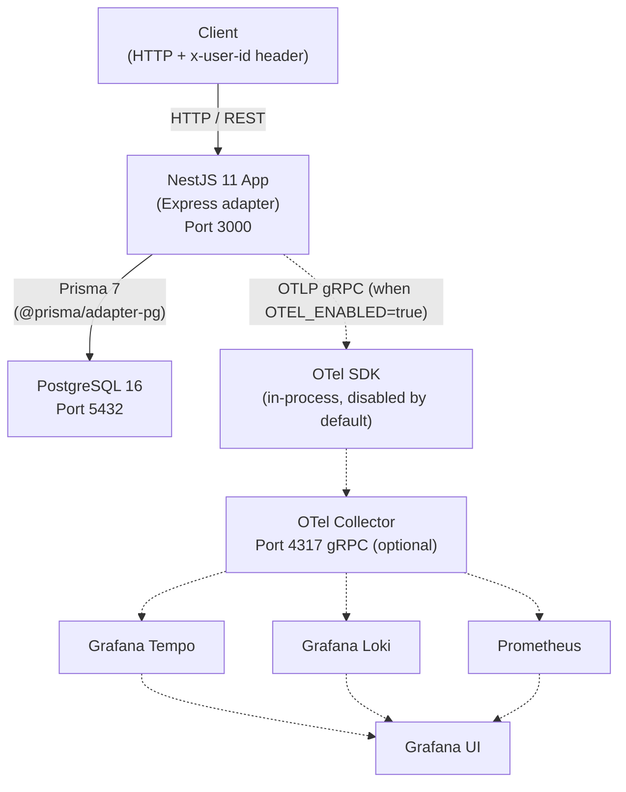

# High-Level Architecture

<!-- DOC-SYNC: Diagram updated on 2026-04-17. Redis/BullMQ removed; JWT + API Key stripped in favour of header-based mock auth. Please verify visual accuracy before committing. -->

## System Overview

Dashed edges are optional and only active when `OTEL_ENABLED=true`.

## Component Descriptions

| Component | Role |
|-----------|------|
| **NestJS App** | Stateless API server. Handles HTTP, mock auth, validation, business logic |
| **PostgreSQL 16** | Primary data store — companies, users, departments (tree), tweets, tweet-department pivots |
| **OTel SDK** | Optional in-process OpenTelemetry node SDK; captures traces, metrics, and log correlation |
| **OTel Collector** | Optional fan-out to Tempo / Loki / Prometheus |
| **Tempo / Loki / Prometheus / Grafana** | Optional observability backends |

> **Note:** Redis + BullMQ are no longer part of this build — the assignment
> has no async-job requirement. `QueueModule` has been removed.

## Network

In dev, NestJS and Postgres run locally (or in Docker Compose). In production
replace with managed Postgres and your preferred container runtime.

## Data Flow — Happy Path Request

1. Client sends `POST /api/v1/tweets` with `x-user-id: <uuid>` and a JSON body.
2. `RequestIdMiddleware` injects `x-request-id`.
3. `SecurityHeadersMiddleware` (Helmet) sets headers.
4. `MockAuthMiddleware` resolves the user, loads their company + direct
   department memberships, and publishes `{ userId, companyId,
   userDepartmentIds }` into CLS. On missing/unknown header → `401 AUT0001`.
5. `AuthContextGuard` (`APP_GUARD`) confirms `companyId` is present in CLS.
   `@Public()` routes bypass this check.
6. `ZodValidationPipe` validates the request body against
   `CreateTweetSchema`.
7. `TweetsController` delegates to `TweetsService`.
8. For `DEPARTMENTS*` visibility, service pre-validates `departmentIds` via
   `DepartmentsDbService.findExistingIdsInCompany` — cross-tenant ids silently
   drop (tenant-scope extension), so a length mismatch throws `VAL0008`.
9. `TweetsDbService.createWithTargets` runs a transaction: flat `create` on
   `Tweet`, then flat `createMany` on `TweetDepartment` with explicit
   `companyId` on every row.
10. Response flows through `TransformInterceptor` → `{ success: true, data: ... }`.
11. `LoggingInterceptor` logs request completion with duration.
12. Response returned to client.
