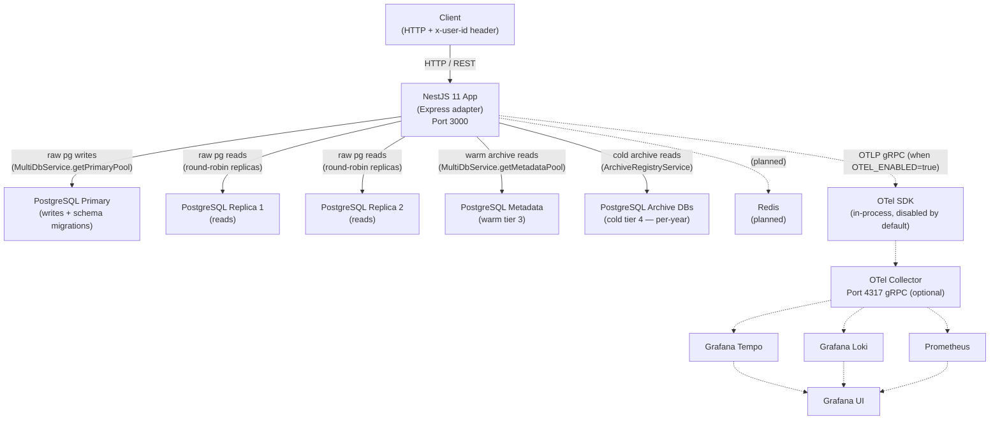

# High-Level Architecture

<!-- DOC-SYNC: Diagram updated on 2026-04-25 for the Order Management pivot (feat/observability). Multi-tier DB topology added (primary, replicas, metadata, cold archives). Data flow example updated from tweets to orders. Please verify visual accuracy before committing. -->

## System Overview

Dashed edges are optional / planned and only active when configured.

## Component Descriptions

| Component                               | Role                                                                                                                                       |
| --------------------------------------- | ------------------------------------------------------------------------------------------------------------------------------------------ |
| **NestJS App**                          | Stateless API server. Handles HTTP, mock auth, validation, business logic, multi-tier DB routing                                           |
| **PostgreSQL Primary**                  | Hot tier (tier 2) — accepts all writes; holds `orders_recent`, `user_order_index`, `archive_databases`, `products`, `partition_simulation` |
| **PostgreSQL Replicas (1, 2)**          | Hot tier reads — round-robin via `MultiDbService.getReadPool()`                                                                            |
| **PostgreSQL Metadata**                 | Warm tier (tier 3) — orders 1–2 years old                                                                                                  |
| **PostgreSQL Archive DBs**              | Cold tier (tier 4) — per-year cold-archive databases; lazily connected via `ArchiveRegistryService`                                        |
| **Redis**                               | Planned — not yet implemented in this branch                                                                                               |
| **OTel SDK**                            | Optional in-process OpenTelemetry node SDK; captures traces, metrics, and log correlation                                                  |
| **OTel Collector**                      | Optional fan-out to Tempo / Loki / Prometheus                                                                                              |
| **Tempo / Loki / Prometheus / Grafana** | Optional observability backends                                                                                                            |

## Network

In dev, NestJS and Postgres run locally (or in Docker Compose). In production
replace with managed Postgres and your preferred container runtime. The
multi-tier DB topology requires separate connection details per tier — see
`docs/infrastructure/02-environment-configuration.md` for the full env-var
reference.

## Data Flow — Happy Path Request (Order Lookup)

1. Client sends `GET /api/v1/orders/:id` with `x-user-id: <positive-integer>`.
2. `RequestIdMiddleware` injects `x-request-id`.
3. `SecurityHeadersMiddleware` (Helmet) sets headers.
4. `MockAuthMiddleware` validates `x-user-id` is a positive integer and publishes `{ userId }` into CLS.
   On missing or non-integer header → `401 AUT0001`.
5. `AuthContextGuard` (`APP_GUARD`) confirms context is present in CLS.
   `@Public()` routes bypass this check.
6. Controller delegates to `OrdersService`.
7. Service queries `user_order_index` on the primary pool to determine `tier`.
8. Based on tier, service fetches the order from the appropriate pool:
   - tier 2 → `MultiDbService.getReadPool()`
   - tier 3 → `MultiDbService.getMetadataPool()`
   - tier 4 → `ArchiveRegistryService.getPoolForYear(year, 4)`
9. Response flows through `TransformInterceptor` → `{ success: true, data: ... }`.
10. `LoggingInterceptor` logs request completion with duration.
11. Response returned to client.
