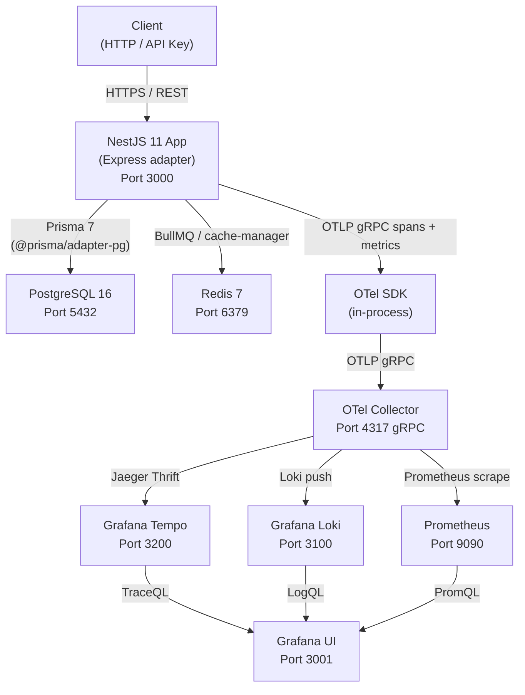

# High-Level Architecture

## System Overview

## Component Descriptions

| Component | Role |
|-----------|------|
| **NestJS App** | Stateless API server. Handles HTTP, auth, validation, business logic, queue job dispatch |
| **PostgreSQL 16** | Primary data store for all domain entities (users, todos, tags, tokens, API keys) |
| **Redis 7** | BullMQ job queues + cache-manager response caching |
| **OTel SDK** | In-process OpenTelemetry node SDK; captures traces, metrics, and log correlation |
| **OTel Collector** | Central fan-out: receives OTLP from app, routes to Tempo/Loki/Prometheus |
| **Tempo** | Distributed trace storage and TraceQL query engine |
| **Loki** | Log aggregation with label indexing |
| **Prometheus** | Time-series metrics store |
| **Grafana** | Unified observability dashboard (pre-provisioned datasources + dashboards) |

## Network

All services communicate over the `app-network` Docker bridge network.
In production, replace Docker bridge with Kubernetes Service discovery or a service mesh.

## Data Flow — Happy Path Request

1. Client sends `POST /api/v1/auth/login` with `{ email, password }`.
2. `RequestIdMiddleware` injects `x-request-id` header.
3. `SecurityHeadersMiddleware` (Helmet) sets security headers.
4. `ThrottlerGuard` checks rate limit via Redis.
5. `JwtAuthGuard` skips (route is `@Public()`).
6. `ZodValidationPipe` validates request body.
7. `AuthController.login()` delegates to `AuthService.login()`.
8. `AuthService` queries PostgreSQL via Prisma, compares bcrypt hash.
9. OTel SDK records span and metrics for Prisma query.
10. Response goes through `TransformInterceptor` → `{ success: true, data: ... }`.
11. `LoggingInterceptor` logs request completion with duration.
12. Response returned to client.
