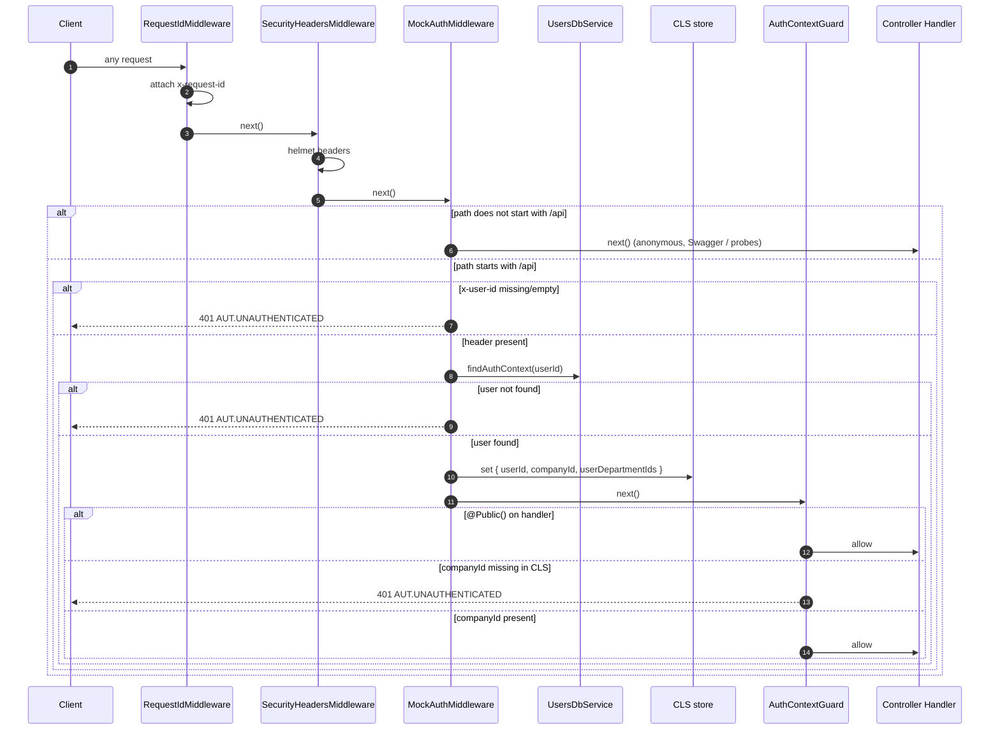

# Mock Authentication & Tenant Context Flow

<!-- DOC-SYNC: Diagram created on 2026-04-17 to replace auth-flow.md (JWT + API Key stack was stripped). Please verify visual accuracy before committing. -->

## Overview

The assignment explicitly permits a mocked authentication strategy. This build
takes that route and removes the JWT + API Key stack entirely.

Every `/api` request must carry an `x-user-id` header. The
`MockAuthMiddleware` resolves it to a full tuple of `{ userId, companyId,
userDepartmentIds }` and publishes those values into **CLS**
(`nestjs-cls`, AsyncLocalStorage-backed). Downstream code — services, the
Prisma tenant-scope extension, the raw-SQL timeline query — reads from CLS,
never from the request object.

A global `AuthContextGuard` (`APP_GUARD`) is the fail-fast backstop: if it
runs and CLS has no `companyId`, the request is rejected with 401 before any
query can execute.

---

## Request Lifecycle

---

## Who reads CLS

| Reader                          | Purpose |
|---------------------------------|---------|
| `TweetsService`, `DepartmentsService` | Resolve `userId` / `companyId` before calling the DB layer |
| `tenantScopeExtension` (Prisma `$extends`) | Inject `where.companyId` into reads; reject writes whose `companyId` disagrees |
| `TweetsDbRepository.findTimelineForUser` | Parameterise the raw-SQL query (`company_id = ${companyId}` hard-coded in every predicate) |

---

## Swapping in real auth (future)

Replace `MockAuthMiddleware` with a Passport/JWT guard (or equivalent) that
populates the **same** three CLS keys. Everything downstream is unchanged —
that's the whole point of centralising tenant context in CLS.

- `ClsKey.USER_ID`
- `ClsKey.COMPANY_ID`
- `ClsKey.USER_DEPARTMENT_IDS`

---

## Why CLS instead of `req.user`?

`req.user` is available only inside the HTTP request/response boundary. The
Prisma extension runs at ORM depth — multiple awaits deep, sometimes inside
transaction callbacks — and shouldn't have to reach back to the Express
`Request` object. CLS (AsyncLocalStorage) is the standard Node.js way to
thread request-scoped context without passing it as a function argument.

Seed scripts and background scripts that legitimately need to bypass tenant
scope set `ClsKey.BYPASS_TENANT_SCOPE = true` explicitly. Silent absence of
`companyId` is treated as a security violation (`AUZ.CROSS_TENANT_ACCESS`).
