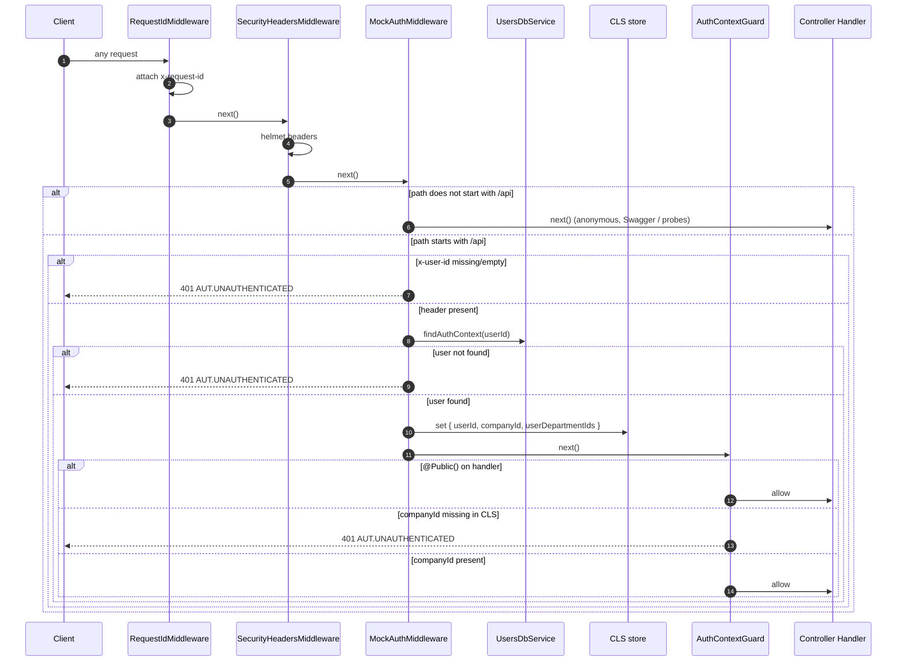

# Mock Authentication & Tenant Context Flow

<!-- DOC-SYNC: Diagram updated on 2026-04-25 for the Order Management pivot (feat/observability). UsersDbService removed; MockAuthMiddleware now resolves userId from the header without a DB lookup (or via primary pool directly — TBD in feat/om-orders). CLS now carries userId only (no companyId / userDepartmentIds in the order-management domain). Please verify visual accuracy before committing. -->

## Overview

The assignment explicitly permits a mocked authentication strategy. This build
takes that route and removes the JWT + API Key stack entirely.

Every `/api` request must carry an `x-user-id` header. The
`MockAuthMiddleware` resolves it and publishes the `userId` into **CLS**
(`nestjs-cls`, AsyncLocalStorage-backed). Downstream code — services and raw
SQL queries — reads from CLS, never from the request object.

A global `AuthContextGuard` (`APP_GUARD`) is the fail-fast backstop: if it
runs and CLS has no user context, the request is rejected with 401 before any
query can execute.

> Note: In the enterprise-twitter domain, `MockAuthMiddleware` called
> `UsersDbService.findAuthContext()` to resolve `{ userId, companyId,
userDepartmentIds }`. `UsersDbService` was removed in the
> `feat/observability` pivot. The order-management domain uses `userId` as the
> primary identity key; `companyId` is not part of the auth context.

---

## Request Lifecycle

---

## Who reads CLS

| Reader                      | Purpose                                                                                  |
| --------------------------- | ---------------------------------------------------------------------------------------- |
| `OrdersService` (planned)   | Resolve `userId` before querying `user_order_index` and routing to the correct tier pool |
| `ArchivalService` (planned) | Resolve `userId` for user-scoped archival operations                                     |
| Feature services (general)  | Read `ClsKey.USER_ID` via `ClsService.get(ClsKey.USER_ID)`                               |

> Note: `tenantScopeExtension` (Prisma `$extends`) was removed in
> `feat/observability`. Tenant/user isolation is now enforced via explicit
> `WHERE user_id = $1` parameterised SQL in each service.

---

## Swapping in real auth (future)

Replace `MockAuthMiddleware` with a Passport/JWT guard (or equivalent) that
populates the **same** CLS keys. Everything downstream is unchanged —
that's the whole point of centralising user context in CLS.

- `ClsKey.USER_ID`

(In the order-management domain, `ClsKey.COMPANY_ID` and
`ClsKey.USER_DEPARTMENT_IDS` are not used — they were enterprise-twitter
concepts.)

---

## Why CLS instead of `req.user`?

`req.user` is available only inside the HTTP request/response boundary.
Services and pool-query helpers run multiple awaits deep and shouldn't have to
reach back to the Express `Request` object. CLS (AsyncLocalStorage) is the
standard Node.js way to thread request-scoped context without passing it as a
function argument.
