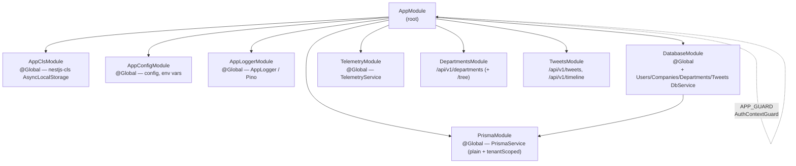

# Service Architecture — NestJS Module Graph

<!-- DOC-SYNC: Diagram rewritten on 2026-04-17 for the Enterprise Twitter pivot. Auth/Users/TodoLists/TodoItems/Tags/Queue/Health/Throttler/Health modules replaced by Departments + Tweets + CLS + global guard. Please verify visual accuracy before committing. -->

## Module Import Graph



## Global Modules

Global modules are registered once in `AppModule` and inject into any module without explicit import:

| Module            | Provides |
|-------------------|----------|
| `AppClsModule`    | `nestjs-cls` ClsService + middleware registration |
| `AppConfigModule` | `AppConfigService` |
| `AppLoggerModule` | `AppLogger` |
| `PrismaModule`    | `PrismaService` (plain client + `tenantScoped` extended client) |
| `DatabaseModule`  | `DatabaseService`, `UsersDbService`, `CompaniesDbService`, `DepartmentsDbService`, `TweetsDbService` |
| `TelemetryModule` | `TelemetryService`, `@Trace`, `@InstrumentClass` |

## Module Responsibilities

| Module               | Controller(s)             | Service(s)            | Key Providers |
|----------------------|---------------------------|-----------------------|---------------|
| `DepartmentsModule`  | `DepartmentsController`   | `DepartmentsService`  | — (DB layer is global) |
| `TweetsModule`       | `TweetsController`        | `TweetsService`       | — (DB layer is global) |
| `DatabaseModule`     | —                         | `DatabaseService` + per-aggregate `*DbService`s | per-aggregate `*DbRepository`s, `PrismaService.tenantScoped` |

## Middleware & Cross-Cutting Pipeline

```
Request
  → RequestIdMiddleware        (inject x-request-id)
  → SecurityHeadersMiddleware  (Helmet headers)
  → MockAuthMiddleware         (x-user-id → findAuthContext → set CLS tuple)
  → AuthContextGuard (APP_GUARD)  (require companyId in CLS; @Public() opt-out)
  → ZodValidationPipe          (per-route DTO validation)
  → Controller Handler
  → LoggingInterceptor         (log request + response duration)
  → TransformInterceptor       (wrap in { success, data })
  → TimeoutInterceptor         (abort if > configurable timeout)
Response
```

Exception path:

```
Thrown error
  → AllExceptionsFilter        (catches everything; thin filter)
     → handlePrismaError()     (maps Prisma errors → ErrorException with cause)
     → ErrorException.wrap()   (wraps unknown errors as SRV0001)
  → errorException.toResponse(includeChain) → structured JSON response
```

Fallback Express error handler registered AFTER `app.listen()` in `main.ts`
catches any 404s from the router layer that escape NestJS's filter chain (e.g.,
intercepted by OTel Express instrumentation).
