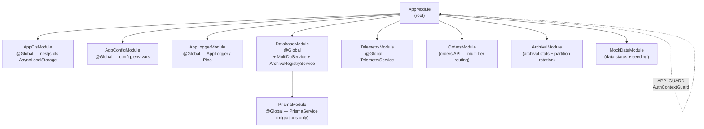

# Service Architecture — NestJS Module Graph

<!-- DOC-SYNC: Diagram updated on 2026-04-25. Departments + Tweets modules replaced by fully-implemented Orders + Archival + MockData modules. DatabaseModule now provides MultiDbService + ArchiveRegistryService + per-aggregate DbServices. Middleware description updated to reflect simplified MockAuthMiddleware (no DB lookup). Please verify visual accuracy before committing. -->

## Module Import Graph



## Global Modules

Global modules are registered once in `AppModule` and inject into any module without explicit import:

| Module            | Provides                                                               |
| ----------------- | ---------------------------------------------------------------------- |
| `AppClsModule`    | `nestjs-cls` ClsService + middleware registration                      |
| `AppConfigModule` | `AppConfigService` (incl. typed `.get` accessor for multi-DB env vars) |
| `AppLoggerModule` | `AppLogger`                                                            |
| `PrismaModule`    | `PrismaService` (for migrations only — not used for runtime queries)   |
| `DatabaseModule`  | `MultiDbService`, `ArchiveRegistryService`                             |
| `TelemetryModule` | `TelemetryService`, `@Trace`, `@InstrumentClass`                       |

## Module Responsibilities

| Module           | Controller(s)        | Service(s)                                                            | Key Providers                                              |
| ---------------- | -------------------- | --------------------------------------------------------------------- | ---------------------------------------------------------- |
| `OrdersModule`   | `OrdersController`   | `OrdersService`, `OrdersDbRepository`                                 | `OrdersDbService` (injected from `DatabaseModule`)         |
| `ArchivalModule` | `ArchivalController` | `ArchivalService`, `PartitionRotationService`, `ArchivalDbRepository` | Routes to correct tier pool via `ArchiveRegistryService`   |
| `MockDataModule` | `MockDataController` | `MockDataService`, `MockDataDbRepository`                             | Data status + seeding instructions                         |
| `DatabaseModule` | —                    | `MultiDbService`, `ArchiveRegistryService`                            | `pg.Pool` instances (primary, replicas, metadata, archive) |

## Middleware & Cross-Cutting Pipeline

```
Request
  → RequestIdMiddleware        (inject x-request-id)
  → SecurityHeadersMiddleware  (Helmet headers)
  → MockAuthMiddleware         (x-user-id → parse integer → set CLS { userId })
  → AuthContextGuard (APP_GUARD)  (require userId in CLS; @Public() opt-out)
  → ZodValidationPipe          (per-route DTO validation)
  → Controller Handler
  → LoggingInterceptor         (log request + response duration)
  → TransformInterceptor       (wrap in { success, data })
  → TimeoutInterceptor         (abort if > configurable timeout)
Response
```

Exception path:

```
Thrown error
  → AllExceptionsFilter        (catches everything; thin filter)
     → handlePrismaError()     (maps Prisma errors → ErrorException with cause)
     → ErrorException.wrap()   (wraps unknown errors as SRV0001)
  → errorException.toResponse(includeChain) → structured JSON response
```

Fallback Express error handler registered AFTER `app.listen()` in `main.ts`
catches any 404s from the router layer that escape NestJS's filter chain (e.g.,
intercepted by OTel Express instrumentation).
