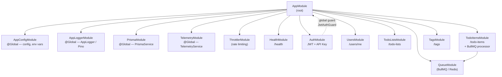

# Service Architecture — NestJS Module Graph

## Module Import Graph



## Global Modules

Global modules are registered once in `AppModule` and inject into any module without explicit import:

| Module            | Provides           |
| ----------------- | ------------------ |
| `AppConfigModule` | `AppConfigService` |
| `AppLoggerModule` | `AppLogger`        |
| `PrismaModule`    | `PrismaService`    |
| `TelemetryModule` | `TelemetryService` |

## Module Responsibilities

| Module            | Controller(s)                         | Service(s)                      | Key Providers                                                         |
| ----------------- | ------------------------------------- | ------------------------------- | --------------------------------------------------------------------- |
| `AuthModule`      | `AuthController`, `ApiKeysController` | `AuthService`, `ApiKeysService` | `JwtModule`, `JwtStrategy`, `ApiKeyStrategy`, `JwtAuthGuard` (global) |
| `UsersModule`     | `UsersController`                     | `UsersService`                  | —                                                                     |
| `TodoListsModule` | `TodoListsController`                 | `TodoListsService`              | `TodoListRepository`                                                  |
| `TodoItemsModule` | `TodoItemsController`                 | `TodoItemsService`              | `TodoItemRepository`, `TodoItemProcessor` (BullMQ)                    |
| `TagsModule`      | `TagsController`                      | `TagsService`                   | —                                                                     |
| `HealthModule`    | `HealthController`                    | —                               | `TerminusModule`                                                      |
| `QueueModule`     | —                                     | —                               | `BullModule` (Redis connection)                                       |

## Middleware & Cross-Cutting Pipeline

```
Request
  → RequestIdMiddleware        (inject x-request-id)
  → SecurityHeadersMiddleware  (Helmet headers)
  → ThrottlerGuard             (rate limit)
  → JwtAuthGuard               (global; skipped on @Public routes)
  → ZodValidationPipe          (per-route DTO validation)
  → Controller Handler
  → LoggingInterceptor         (log request + response duration)
  → TransformInterceptor       (wrap in { success, data })
  → TimeoutInterceptor         (abort if > configurable timeout)
Response
```

Exception path:

```
Thrown error
  → AllExceptionsFilter        (catches everything; thin filter)
     → handlePrismaError()     (maps Prisma errors → ErrorException with cause)
     → ErrorException.wrap()   (wraps unknown errors as SRV0001)
  → errorException.toResponse(includeChain) → structured JSON response
```
