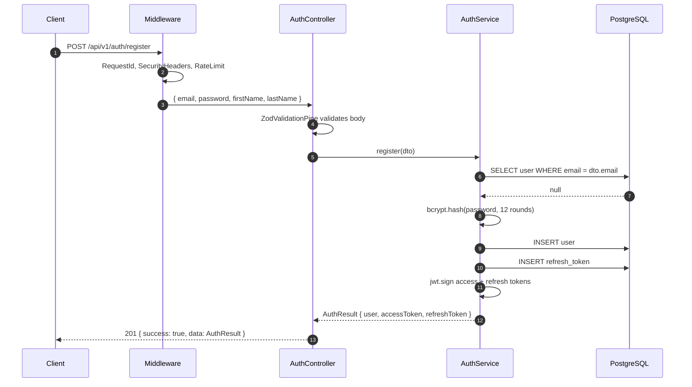
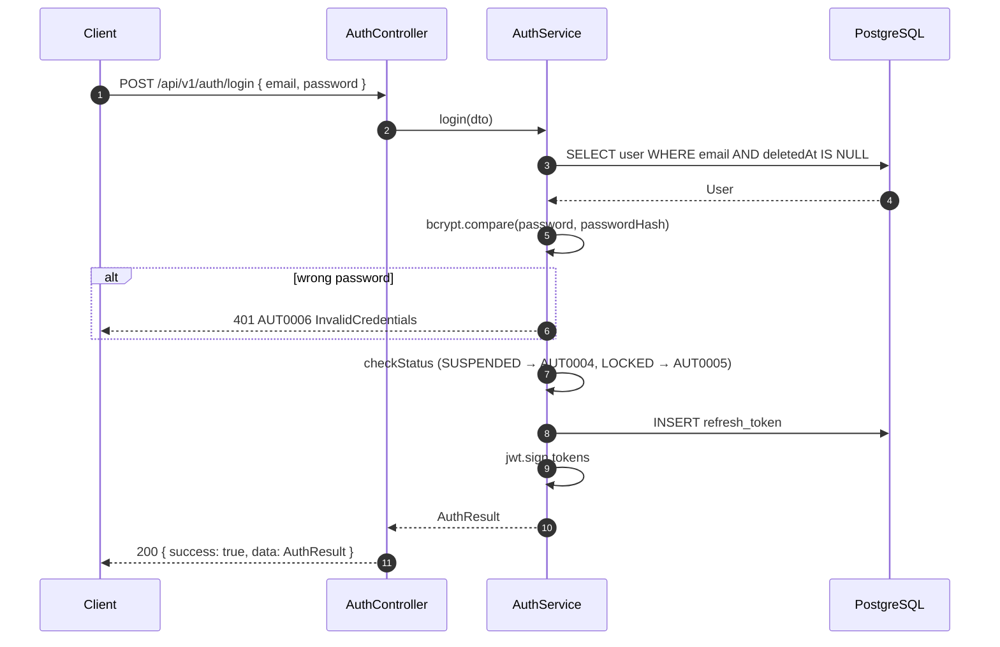
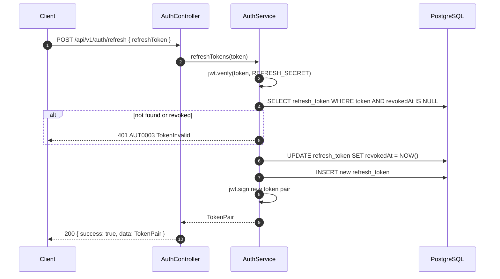
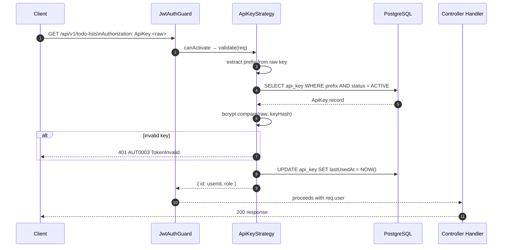

# Auth Sequence Diagrams

<!-- DOC-SYNC: Diagram updated on 2026-04-17. Database calls now route through AuthCredentialsDbService/UsersDbService instead of direct Prisma. Participants labelled "PG" (PostgreSQL) are still conceptually correct at sequence level but the internal path is AS → *DbService → *DbRepository → PG. Please verify visual accuracy before committing. -->

> For the architecture context behind these flows, see `docs/architecture/auth-flow.md`.

## Register

## Login

## Refresh Token

## API Key Authentication

