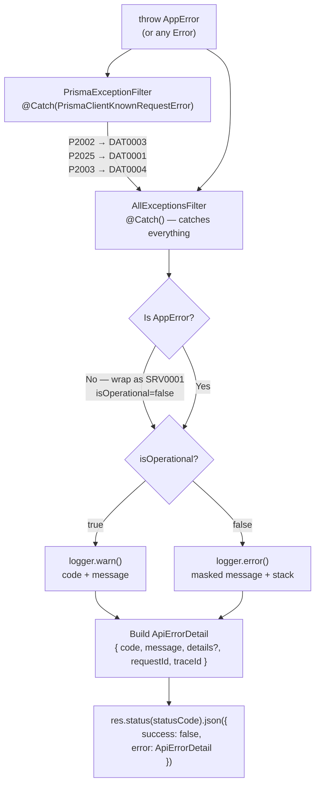

# Error Handling Flow

> See `docs/guides/FOR-Error-Handling.md` for the full feature guide.
> See `docs/coding-guidelines/07-error-handling.md` for coding patterns.

## Exception Filter Chain



## Error Code Taxonomy

| Prefix | Domain | Example |
|--------|--------|---------|
| `GEN` | General / rate limit | `GEN0001` rate limit exceeded |
| `VAL` | Validation | `VAL0001` invalid input, `VAL0004` invalid status transition |
| `AUT` | Authentication | `AUT0006` invalid credentials, `AUT0002` token expired |
| `AUZ` | Authorization | `AUZ0001` access forbidden |
| `DAT` | Database / data | `DAT0001` not found, `DAT0003` unique violation |
| `SRV` | Server / infra | `SRV0001` internal server error |

## Standard Error Response Shape

```json
{
  "success": false,
  "error": {
    "code": "DAT0001",
    "message": "TodoList with identifier 'abc-123' not found",
    "details": null,
    "requestId": "550e8400-e29b-41d4-a716-446655440000",
    "traceId": "abc123def456"
  }
}
```

## Prisma Error Mapping

| Prisma Code | Mapped To | Description |
|-------------|-----------|-------------|
| `P2002` | `DAT0003` — Unique constraint violation | Duplicate email, tag name, etc. |
| `P2025` | `DAT0001` — Resource not found | Record required for update/delete not found |
| `P2003` | `DAT0004` — Foreign key constraint | Referenced record does not exist |
| Others | `DAT0007` — Query failed | Unexpected Prisma error |
