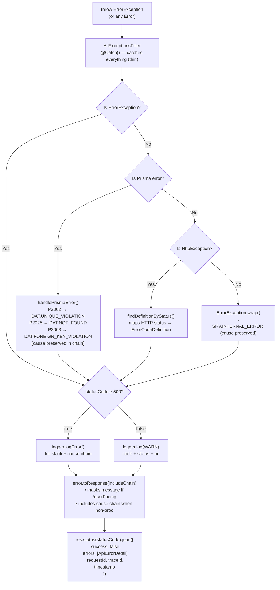

# Error Handling Flow

> See `docs/guides/FOR-Error-Handling.md` for the full feature guide.
> See `docs/coding-guidelines/07-error-handling.md` for coding patterns.

<!-- DOC-SYNC: Diagram updated on 2026-04-16. Please verify visual accuracy before committing. -->

## Exception Filter Chain



## Error Code Taxonomy

| Prefix | Domain               | Example                                                      |
| ------ | -------------------- | ------------------------------------------------------------ |
| `GEN`  | General / rate limit | `GEN0001` rate limit exceeded                                |
| `VAL`  | Validation           | `VAL0001` invalid input, `VAL0004` invalid status transition |
| `AUT`  | Authentication       | `AUT0006` invalid credentials, `AUT0002` token expired       |
| `AUZ`  | Authorization        | `AUZ0001` access forbidden                                   |
| `DAT`  | Database / data      | `DAT0001` not found, `DAT0003` unique violation              |
| `SRV`  | Server / infra       | `SRV0001` internal server error                              |

## Standard Error Response Shape

```json
{
  "success": false,
  "errors": [
    {
      "code": "DAT0001",
      "message": "TodoList with identifier 'abc-123' not found",
      "errorType": "NOT_FOUND",
      "errorCategory": "CLIENT",
      "retryable": false
    }
  ],
  "requestId": "550e8400-e29b-41d4-a716-446655440000",
  "traceId": "abc123def456",
  "timestamp": "2026-04-16T12:00:00.000Z"
}
```

In non-production, the response may also include a `cause` chain on each error
(`{ code?, message }[]`, depth-limited to 5 in responses, 10 in logs).

## Prisma Error Mapping

| Prisma Code | Mapped To                               | Description                                 |
| ----------- | --------------------------------------- | ------------------------------------------- |
| `P2002`     | `DAT0003` — Unique constraint violation | Duplicate email, tag name, etc.             |
| `P2025`     | `DAT0001` — Resource not found          | Record required for update/delete not found |
| `P2003`     | `DAT0004` — Foreign key constraint      | Referenced record does not exist            |
| Others      | `DAT0007` — Query failed                | Unexpected Prisma error                     |
