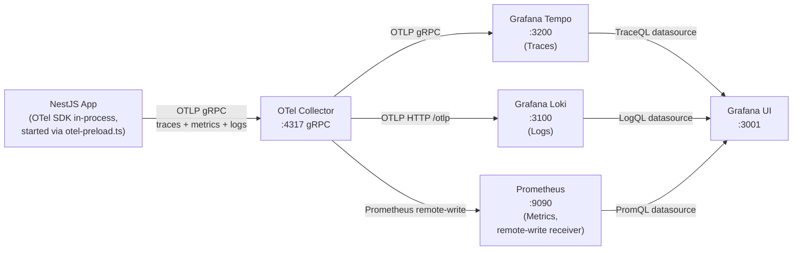

# Observability Pipeline

<!-- DOC-SYNC: Diagram updated on 2026-04-17 — logs now flow Pino→OTel Logs API→OTLP gRPC→collector→Loki (was: pino-loki direct). Metrics now use Prometheus remote-write (push), no longer a scrape target on :8889. OTel SDK init moved to `src/telemetry/otel-preload.ts` (side-effect import). Please verify visual accuracy before committing. -->

> See `docs/guides/FOR-Observability.md` for the full feature guide.
> See `docs/infrastructure/04-grafana-stack-setup.md` for setup instructions.

## Pipeline Diagram

Notes:

- Logs ride the same OTLP channel as traces. `@opentelemetry/instrumentation-pino` forwards every Pino log to the OTel Logs API; a `BatchLogRecordProcessor` + `OTLPLogExporter` ship them to the collector, which fans out to Loki.
- Metrics are **pushed** via `prometheusremotewrite` exporter on the collector. Prometheus runs with `--web.enable-remote-write-receiver`. There is no scrape target on the app or the collector.

## Signals Captured

### Traces

- All HTTP requests (auto-instrumented via `@opentelemetry/instrumentation-http` + `instrumentation-express`)
- All Prisma queries (auto-instrumented)
- Custom spans via `@Trace()` decorator on service methods
- Custom spans via `@InstrumentClass()` decorator (wraps all public methods)

### Metrics

- HTTP request count (`http_requests_total`)
- HTTP request duration histogram (`http_request_duration_seconds`)
- Custom counters via `@IncrementCounter('metric_name')`
- Custom durations via `@RecordDuration('metric_name')`

### Logs

- Structured JSON via Pino (nestjs-pino)
- Every log record includes: `traceId`, `spanId`, `requestId`, `userId`, `companyId` (when available, via CLS)
- `AppLogger.logEvent(eventName, { attributes })` — semantic event logging (always INFO)
- `AppLogger.logError(eventName, error, { attributes })` — structured error logging (always ERROR, records OTel span status)

## Correlation

Every log record emitted during an HTTP request lifecycle is correlated by:

- `traceId` — OTel trace ID, links log to Tempo trace
- `spanId` — OTel span ID
- `requestId` — UUID injected by `RequestIdMiddleware`, returned as `x-request-id` response header

Grafana supports trace-to-logs correlation via the `traceId` field.

## Environment Variables

| Variable                      | Purpose                                    | Default                 |
| ----------------------------- | ------------------------------------------ | ----------------------- |
| `OTEL_ENABLED`                | Enable/disable OTel SDK                    | `false`                 |
| `OTEL_SERVICE_NAME`           | Service name in traces                     | `order-management`      |
| `OTEL_EXPORTER_OTLP_ENDPOINT` | OTel Collector gRPC endpoint               | (required when enabled) |
| `OTEL_EXPORTER_OTLP_PROTOCOL` | Transport: `grpc`, `http`, `http/protobuf` | `grpc`                  |
