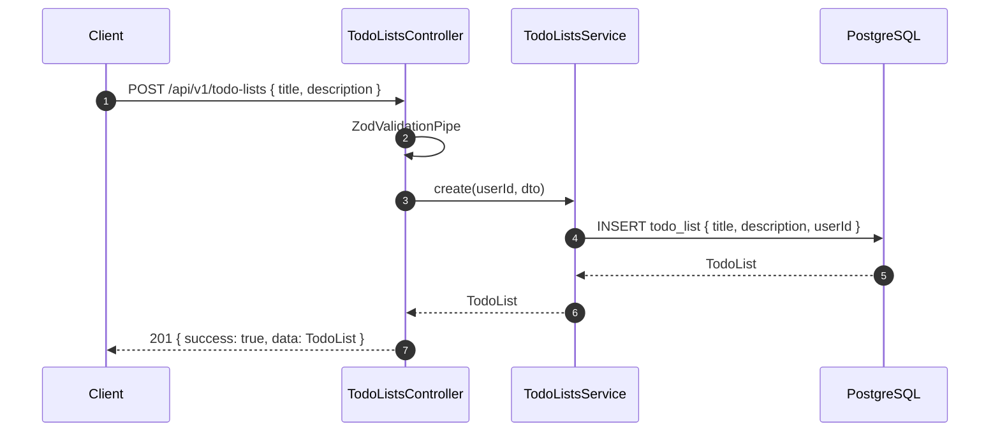
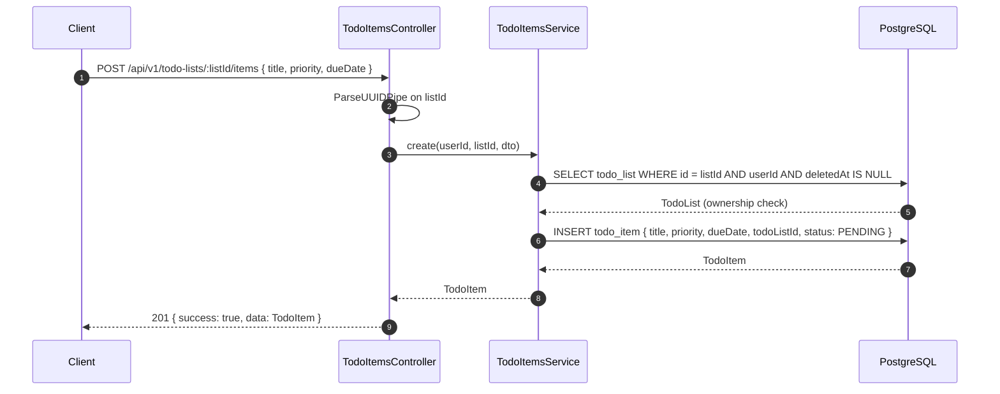
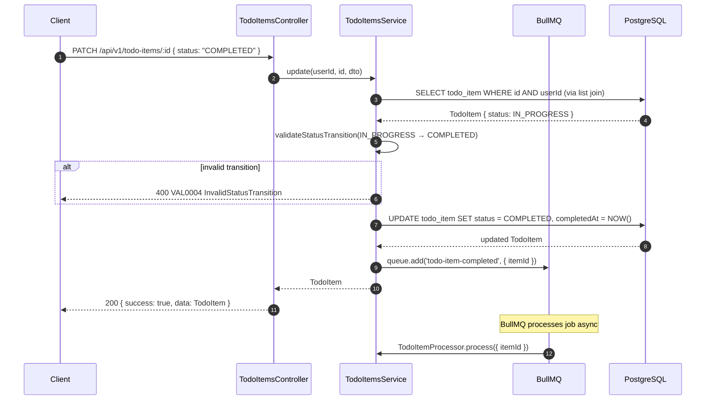
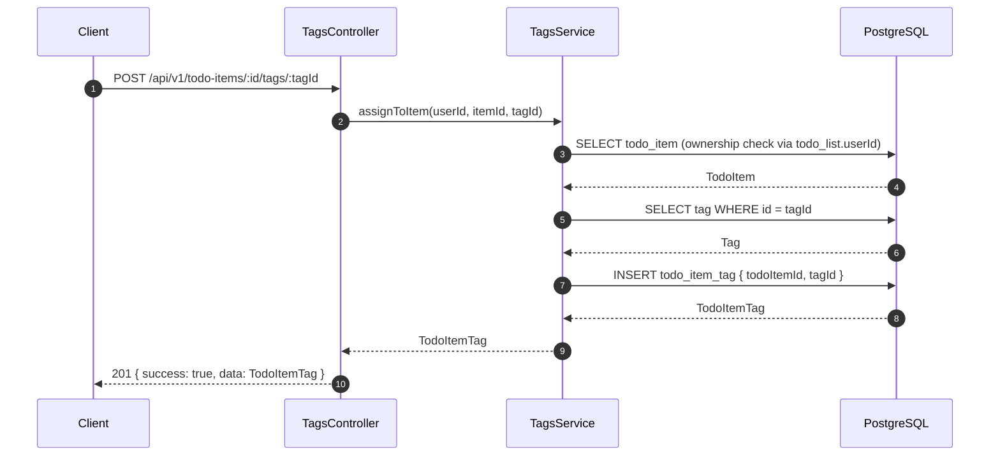
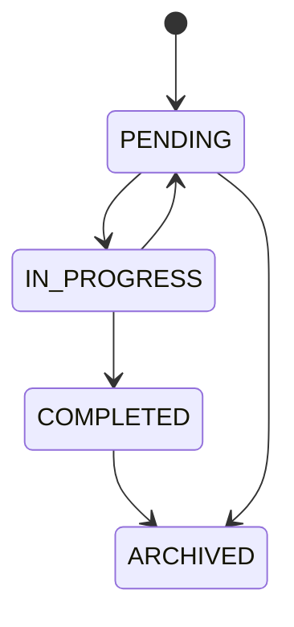

# Todo CRUD Sequence Diagrams

> See `docs/guides/FOR-Todo-Module.md` for the full feature guide.

## Create Todo List

## Create Todo Item

## Update Item Status (Transition)

## Assign Tag to Item

## Valid Status Transitions

