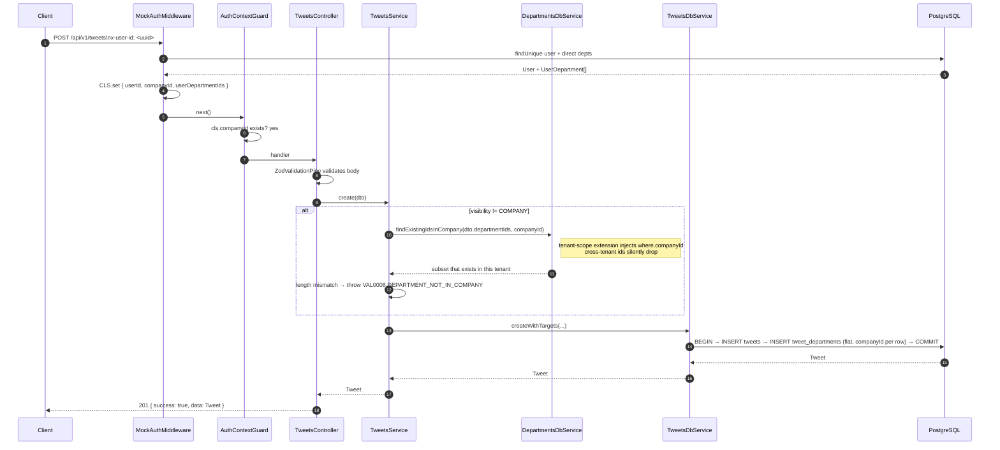
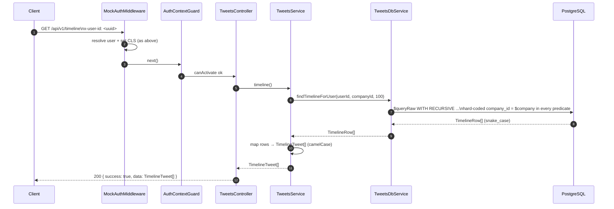
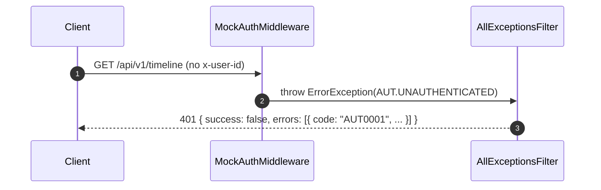
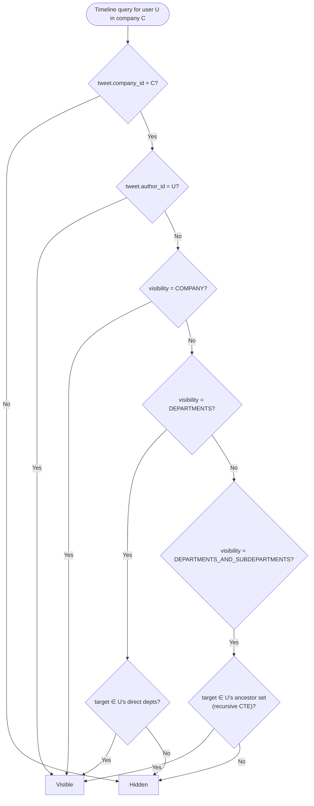

# Tweets / Timeline Sequence Diagrams

<!-- DOC-SYNC: Diagram updated on 2026-04-25. LEGACY: TweetsModule and DepartmentsModule were replaced by OrdersModule/ArchivalModule/MockDataModule. These diagrams describe the enterprise-twitter domain which is no longer the active feature set. The auth flow (x-user-id) has also changed — MockAuthMiddleware no longer calls UsersDbService; it parses the header directly. Retain for historical reference only. Please verify visual accuracy before committing. -->

> See `docs/guides/FOR-Tweets.md` for the full feature guide.
> See `docs/guides/FOR-Multi-Tenancy.md` for the CLS + tenant-scope background.

## Create Tweet

## Get Timeline

## Error path — missing/unknown x-user-id

## Visibility Branches (ACL summary)

