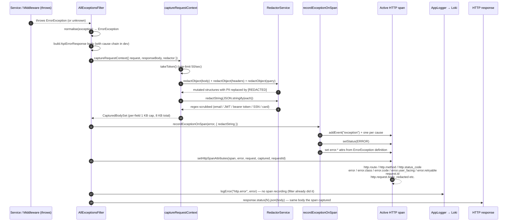
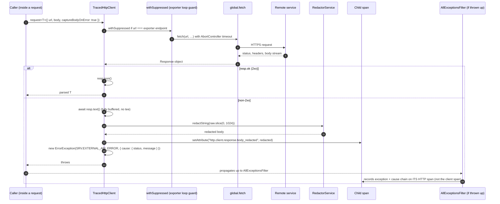
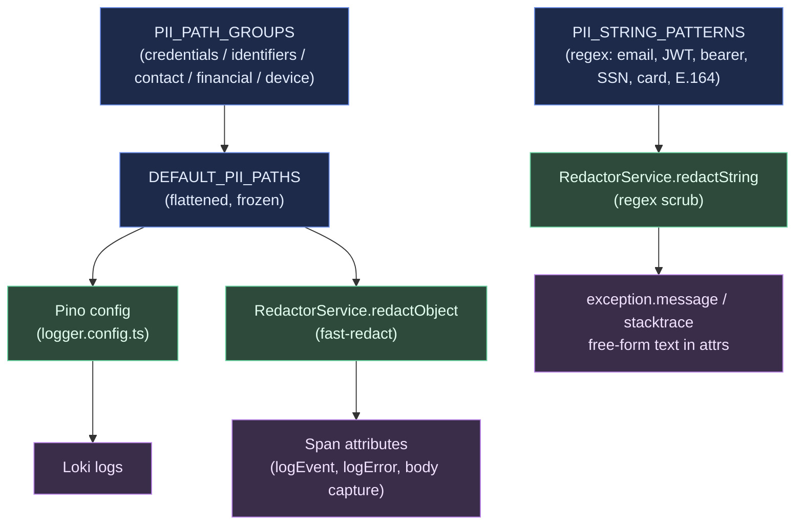

# FOR-Observability.md — Observability Feature Guide

> Related: `docs/diagrams/observability-pipeline.md`, `docs/infrastructure/04-grafana-stack-setup.md`, `docs/coding-guidelines/08-logging-and-tracing.md`, `docs/plans/plan-1-observability-remediation.md`

This service emits three correlated signals:

- **Traces** — OpenTelemetry spans shipped to Tempo over OTLP/gRPC.
- **Logs** — Pino records shipped to Loki (via the OTel collector), every line stamped with `trace_id` / `span_id` so the Loki → Tempo pivot works for every log produced inside a request.
- **Metrics** — pushed to Prometheus via the collector's `prometheusremotewrite` exporter.

All three signals share a PII redaction subsystem with a single-source-of-truth registry that covers logs, span attributes, and span events.

---

## 1. Business Use Case

Observability answers three questions in production:

- **What happened?** → Structured logs in Loki (`trace_id` → pivot to Tempo).
- **Where did time go?** → Distributed traces in Tempo.
- **How is the system behaving over time?** → Metrics in Prometheus.

---

## 2. Flow Diagrams

### 2.1 Observability pipeline

Top-level shape of how an in-process observation lands in Grafana. See `docs/diagrams/observability-pipeline.md` for the full mermaid pipeline diagram.

```
App (OTel SDK)
  → OTLP gRPC → OTel Collector
    → Tempo (traces, TraceQL)
    → Loki (logs, LogQL)
    → Prometheus (metrics, PromQL)
      → Grafana UI (all three datasources)
```

### 2.2 Inbound request — tracing + redaction + correlation

Every `/api/**` request flows through the same chain on the happy path. The `trace_id` is woven into every log line and every span by the Pino mixin + OTel context.

```mermaid
sequenceDiagram
    autonumber
    participant C as Client
    participant H as http auto-instr
    participant M as RequestId/SecurityHeaders/MockAuth middleware
    participant I as TraceEnrichmentInterceptor
    participant S as Service / Repo (@Trace / @InstrumentClass)
    participant P as PrismaInstrumentation
    participant DB as Postgres
    participant T as OTLPTraceExporter
    participant L as Pino → Loki

    C->>H: HTTP POST /api/v1/tweets
    H->>H: start root span (named "POST")
    H->>M: req + active span
    M->>M: RequestIdMiddleware stamps req.id
    M->>M: MockAuthMiddleware resolves user → CLS
    M->>I: handler match; req.route.path set
    I->>I: span.updateName("POST /api/v1/tweets")<br/>setAttribute(ATTR_HTTP_ROUTE, "/api/v1/tweets")
    I->>S: controller method invoked
    S->>S: @Trace creates child span "TweetsController.create"
    S->>P: db.call() (a.k.a. @InstrumentClass)
    P->>DB: pg.query (new child span)
    DB-->>P: row
    P-->>S: result
    S-->>I: response object
    I-->>H: pipes through
    H-->>C: 201 Created
    Note over H,T: root span closes;<br/>FilteringSpanExporter drops `middleware - <anonymous>`<br/>then hands to OTLPTraceExporter
    H->>T: export span tree
    S-->>L: AppLogger.logEvent emits with trace_id from mixin
```

Redaction points on this path: every `logEvent` attribute pair is piped through `RedactorService.redactObject` before both Pino (`info`) and `span.addEvent(...)` land their payloads, so Loki and Tempo receive identical redacted views.

### 2.3 Error path — body capture & redaction

On any thrown exception inside `/api/**`, the filter is the single authoritative HTTP-span recorder. This is the diagram to consult when "why is my trace showing X" becomes a question.



Key invariants enforced by this flow:

- Exactly **one** `exception` event per HTTP span (no duplicates between filter / interceptor / decorator).
- Captured body/headers/query NEVER contain PII matching `DEFAULT_PII_PATHS` — both path-based and regex-based redaction run.
- Span status is `ERROR` for all captured exceptions (4xx and 5xx), with `error.class` discriminating them for dashboards.
- If the body-capture rate limiter is exhausted, attributes fall back to `'[rate-limited]'` — no exception is ever dropped.

### 2.4 Outbound call — TracedHttpClient tier-2 (opt-in)

Use this flow when you're adding a call to a third-party API and the remote JSON error body is actually useful for diagnosis. Tier-1 auto-instrumentation (`requestHook`/`responseHook`) handles the ambient case.



Safety guarantees versus a stream tee:

- The outbound response is consumed exactly once via `await resp.text()` — no listener pollution, no consumer starvation.
- Non-error paths never read the body — `resp.json()` is called directly for 2xx only.
- `captureBodyOnError: false` is a per-call opt-out when you intentionally don't want the remote body on the span (secret-retrieval APIs, long binary responses).
- The remote error message is propagated via `cause` so the filter's cause-chain serialiser shows it as `exception.cause.1` on the caller's HTTP span.

### 2.5 PII redaction — single source of truth

One registry feeds every redaction surface. Adding a new PII field in `pii-registry.ts` is the only change required for it to be masked in Pino logs, span attributes, and free-form strings.



The `allowPII` opt-in on `logEvent` / `logError` short-circuits path (E) for specific registry paths, and emits a one-shot audit log per `(path, callsite)` so bypass is grep-able.

---

## 3. Code Structure

```
src/telemetry/
├── otel-preload.ts                      # Side-effect module — initOtelSdk() runs at import time; MUST be main.ts's first import
├── otel-sdk.ts                          # SDK init — traces/metrics/logs; registers PrismaInstrumentation
├── telemetry.module.ts                  # @Global() module; provides TelemetryService
├── telemetry.service.ts                 # addSpanAttributes(), getCurrentTraceId(), startSpan()
├── otel.constants.ts                    # TRACER_NAME, SPAN_ATTR_CLASS, SPAN_ATTR_METHOD, metric names
├── interfaces/
│   └── telemetry.interfaces.ts          # TraceOptions, InstrumentClassOptions
├── decorators/
│   ├── trace.decorator.ts               # @Trace({ spanName? }) — wraps a method in a child span
│   ├── instrument-class.decorator.ts    # @InstrumentClass() — wraps every public method (walks the prototype chain)
│   └── metric.decorator.ts              # @IncrementCounter(), @RecordDuration()
└── utils/
    └── record-exception.util.ts         # recordExceptionOnSpan() — the one authoritative exception recorder

src/logger/
├── logger.module.ts                     # @Global() module; provides AppLogger
├── logger.service.ts                    # AppLogger — logEvent / logError / log / warn / fatal
├── logger.interfaces.ts                 # IAppLogger, LogLevel, ILogOptions, ILogEventOptions, ILogErrorOptions
├── logger.config.ts                     # Pino transport + trace-context mixin + registry-sourced redact paths
└── utils/
    ├── sanitizer.util.ts                # Back-compat sanitiser; delegates to RedactorService internally
    └── trace-context.util.ts

src/common/redaction/
├── pii-registry.ts                      # PII_PATH_GROUPS, DEFAULT_PII_PATHS — the single source of truth
├── string-patterns.ts                   # Regex scrubber list (jwt, bearer, email, ssn, card, phone)
├── redactor.service.ts                  # RedactorService — redactObject / redactFlatAttributes / redactString
├── redaction.module.ts                  # @Global() module; provides RedactorService
├── redaction.constants.ts               # REDACTION_CENSOR, REDACTION_CENSOR_PREFIX, ALLOW_PII_USED_EVENT
└── allow-pii.util.ts                    # shouldAuditAllowPII() — dedupes audit emissions

src/errors/utils/
└── cause-chain.util.ts                  # serialiseErrorChain() — normalises Error.cause chain into frames
```

---

## 4. Quick start for a new feature

1. **Service** — decorate the class with `@InstrumentClass()`. Every public method gets a child span named `ClassName.method` automatically. Lifecycle hooks (`onModuleInit`, etc.) are excluded by default.
2. **Controller handler** — decorate each handler with `@Trace({ spanName: 'feature.action' })`. Stable span names survive refactors and show up cleanly in Tempo.
3. **Repository / `DbService`** — decorate with `@InstrumentClass()` too. DB calls get wrapped; the Prisma instrumentation additionally emits `prisma:client:operation` and `pg.query` spans underneath.
4. **Ad-hoc PII scrubbing** — inject `RedactorService` if you need to redact something outside the logger/filter paths (e.g. before stashing into CLS or returning a truncated error payload).

The real examples below come straight from `src/modules/tweets/` and `src/database/tweets/` — they compile and are exercised by the test suite.

### Controller — `@Trace` on each handler

```typescript
// src/modules/tweets/tweets.controller.ts
@ApiTags('Tweets')
@ApiSecurity('x-user-id')
@Controller({ version: '1' })
export class TweetsController {
  constructor(private readonly service: TweetsService) {}

  @Post('tweets')
  @HttpCode(HttpStatus.CREATED)
  @UsePipes(new ZodValidationPipe(CreateTweetSchema))
  @Trace({ spanName: 'tweets.create' })
  async create(@Body() dto: CreateTweetDto): Promise<Tweet> {
    return this.service.create(dto);
  }

  @Get('timeline')
  @Trace({ spanName: 'tweets.timeline' })
  async timeline(): Promise<TimelineTweet[]> {
    return this.service.timeline();
  }
}
```

### Service / repository — `@InstrumentClass()`

```typescript
// src/database/tweets/tweets.db-service.ts
@InstrumentClass()
@Injectable()
export class TweetsDbService {
  constructor(
    private readonly repo: TweetsDbRepository,
    private readonly database: DatabaseService,
  ) {}

  async createWithTargets(input: { /* … */ }): Promise<Tweet> {
    /* … */
  }
}
```

No per-method annotation is needed — `@InstrumentClass()` walks the full prototype chain (including inherited methods on `BaseRepository`) and wraps each method exactly once with `@Trace({ spanName: 'ClassName.method' })`.

### The span hierarchy you should see in Tempo

```
HTTP SERVER                                    ← @opentelemetry/instrumentation-http
  └── tweets.create                            ← @Trace on controller handler
        └── TweetsService.create               ← @InstrumentClass on service
              └── TweetsDbService.createWithTargets   ← @InstrumentClass on DB service
                    └── DatabaseService.runInTransaction
                          └── prisma:client:operation   ← @prisma/instrumentation
                                └── pg.query            ← pg auto-instrumentation
```

All spans in a single request share one `traceId` (asserted by `test/e2e/observability.e2e-spec.ts`).

---

## 5. Tracing

### 5.1 Decorators

| Decorator                        | Target | Behaviour                                                                                           |
| -------------------------------- | ------ | --------------------------------------------------------------------------------------------------- |
| `@Trace({ spanName?, kind? })`   | method | Wraps the method in `tracer.startActiveSpan(name, …)`. Works for sync + async. Re-throws unchanged. |
| `@InstrumentClass({ exclude? })` | class  | Walks the prototype chain and applies `@Trace({ spanName: 'ClassName.method' })` to every method.   |

**Span name convention** — use dotted, feature-scoped names for controllers (`tweets.create`, `departments.tree`). `@InstrumentClass` uses `ClassName.method` which is stable across refactors as long as the class keeps its name.

**`@InstrumentClass` prototype walk** — methods inherited from a parent class (e.g. `BaseRepository.findById`) are wrapped once, scoped to the subclass's name. Lifecycle hooks (`constructor`, `onModuleInit`, `onModuleDestroy`, `onApplicationBootstrap`, `onApplicationShutdown`, `beforeApplicationShutdown`) are excluded by default; pass `exclude: ['foo']` to skip additional methods.

**Why decorators aren't DI-managed** — both decorators run at class-declaration time, before the Nest DI container exists. That's why per-call redaction of span events uses a process-level hook (`setDefaultRedactString` in `record-exception.util.ts`) rather than an injected `RedactorService` — see the "What changed from plan" section of `docs/plans/plan-1-observability-remediation.md`.

### 5.2 Recording exceptions

Single source of truth: **`recordExceptionOnSpan(err, { span?, setStatus?, redactString? })`** in `src/telemetry/utils/record-exception.util.ts`.

For each frame in `serialiseErrorChain(err)` (root-most first) it emits:

- `exception` event for frame 0 (OTel semconv name).
- `exception.cause.N` event for each subsequent frame.

Each event carries OTel-standard attributes: `exception.type`, `exception.message` (scrubbed), `exception.stacktrace` (scrubbed), `exception.code` when present, `exception.meta` as JSON when present.

When the root error is an `ErrorException`, it also sets `error.*` span attributes (`error.code`, `error.type`, `error.category`, `error.severity`, `error.user_facing`, `error.retryable`, `error.cause_depth`). For non-`ErrorException`, only `error.cause_depth` is set.

Span status defaults to ERROR; pass `setStatus: false` to skip.

The `redactString` option is applied to both `exception.message` and `exception.stacktrace` before they hit the span. When omitted, the module-level default registered via `setDefaultRedactString` is used (populated at app bootstrap from `RedactorService.redactString`).

### 5.3 Layer ownership — who records on which span

Exactly one layer records per span. This prevents the duplicate-event storm that the plan called out as a pre-fix defect.

| Layer                                    | What it records on which span                                                    | Sets status                 |
| ---------------------------------------- | -------------------------------------------------------------------------------- | --------------------------- |
| `@Trace` decorator (child span)          | `recordExceptionOnSpan(err, { span: child, setStatus: true })`                   | ERROR (unconditional)       |
| `AllExceptionsFilter` (HTTP server span) | `recordExceptionOnSpan(err, { span: active, setStatus: true, redactString: … })` | ERROR (unconditional)       |
| `logger.logError()`                      | `recordExceptionOnSpan(err, { redactString: … })` on the active span             | ERROR (set by the recorder) |
| `LoggingInterceptor`                     | Logs only — does NOT touch spans                                                 | no                          |

As of plan-2 (WP2-3) ALL caught exceptions set `status = ERROR` on the HTTP server span — see [§ 5.5](#55-error-highlighting-in-tempo-deviation-from-http-semconv) for the rationale and the operator-friendly attributes that accompany the flip. The e2e suite asserts both 4xx and 5xx reach ERROR status.

### 5.4 Route naming & cardinality

Every HTTP server span gets renamed to `METHOD route-template` with `:id` / `:hash` placeholders. This keeps Tempo span search human-readable and keeps any metric derived from `http.route` cardinality-safe.

- **Rename mechanism.** `TraceEnrichmentInterceptor` (`src/telemetry/interceptors/trace-enrichment.interceptor.ts`) runs after Nest resolves the controller. It reads `request.route?.path` — the Express-matched route pattern — and writes it to the active span via `span.setAttribute(ATTR_HTTP_ROUTE, route)` + `span.updateName(`${method} ${route}`)`. `ATTR_URL_PATH` carries the raw (unresolved) path for debugging.
- **Pre-router fallback.** If a middleware throws before the router matches (so `req.route.path` is undefined), `AllExceptionsFilter.resolveRoute` calls `normalisePath(originalUrl)` from `src/telemetry/utils/path-normalizer.ts`. Rule-based segment replacement keeps raw ids out of `http.route`:

| Rule     | Pattern                                                                   | Placeholder |
| -------- | ------------------------------------------------------------------------- | ----------- |
| UUID     | `[0-9a-f]{8}-[0-9a-f]{4}-[1-5][0-9a-f]{3}-[89ab][0-9a-f]{3}-[0-9a-f]{12}` | `:id`       |
| ULID     | Crockford base32 × 26 chars                                               | `:id`       |
| ObjectId | `[0-9a-f]{24}`                                                            | `:id`       |
| numeric  | `\d+`                                                                     | `:id`       |
| hash     | `[0-9a-f]{32,}` (sha256 / sha1 fingerprint)                               | `:hash`     |

Rules are precedence-ordered; the first match wins per segment. To add a rule, edit `DEFAULT_RULES` in `path-normalizer.ts` and pick a precedence that lets the new rule fire before its fallback (e.g. a tenant-specific slug should sit above the hash rule). The plan deliberately skipped per-host rule groups until we have ≥ 3 external hosts to worry about.

`http.route` vs `url.path`:

- `http.route`: cardinality-safe, dashboard / alert-ready. Use this in TraceQL / PromQL groupings.
- `url.path`: the raw URL. Use only in per-trace debugging; never group on it.

### 5.5 Error highlighting in Tempo (deviation from HTTP semconv)

Strict OpenTelemetry HTTP semconv reserves `status.code = ERROR` for 5xx responses only. We deliberately deviate: **every caught exception sets `status = ERROR`** on the HTTP server span, regardless of whether it's 4xx or 5xx. See WP2-3 of `docs/plans/plan-2-observability-debuggability.md` for the full rationale. In short:

- Tempo's incident-feed views colour rows by `status.code`. Under strict semconv a 401 / 400 / 409 response stays green (UNSET) and blends into the success rate. Operators miss broken clients for hours.
- Operator visibility on rejected requests is more valuable than strict semconv adherence. Every exception we surface to a caller is worth highlighting.

To restore splitting server- from client-faults:

- `error = true` (scalar) — cardinality-safe "did this request fault at all?" flag.
- `error.class = "4xx" | "5xx"` — cardinality-safe split. Two values; safe to `group_by` in every query engine.
- `http.status_code` — use this for SLO queries (`http.status_code >= 500`), NOT `status.code`.

Dashboards that need to filter for "real" server faults should query `http.status_code >= 500` or `error.class = "5xx"`; queries that want anything-that-went-wrong use `status.code = ERROR` or `error = true`.

### 5.6 Request / response context on error spans

When an exception reaches `AllExceptionsFilter`, we capture the caller's request alongside the exception event so operators can tell what was actually sent. The capture is redacted, bounded, and rate-limited — see `src/telemetry/utils/body-capture.ts`.

Attributes set on the HTTP server span (only on the error path):

| Attribute                       | Contents                                                                         |
| ------------------------------- | -------------------------------------------------------------------------------- |
| `http.request.body_redacted`    | Registry-redacted, free-form-scrubbed JSON of `req.body`. Up to 1 KB.            |
| `http.request.headers_redacted` | Same, for `req.headers`. Authorization / cookies / CSRF tokens always masked.    |
| `http.request.query_redacted`   | Same, for `req.query`.                                                           |
| `http.response.body_redacted`   | The filter's own `ApiErrorResponse` (already built) after redaction. Up to 1 KB. |

Safety rails:

- **Per-field cap: 1 KB**, **total across all four fields: 8 KB** per span. Oversize fields are truncated with a `…[truncated]` sentinel.
- **Token-bucket rate limit: 50 tokens, 50/sec refill.** If the bucket is empty, `captureRequestContext` returns `{ requestBody: '[rate-limited]', requestHeaders: '[rate-limited]' }` so a burst of failures cannot blow up span export.
- **Content-type skiplist.** Binary payloads (`multipart/*`, `image/*`, `video/*`, `application/pdf`, `application/zip`, `application/octet-stream`) emit `[skipped content-type: …]` instead of their bytes.
- **Body-parser sentinel.** When `req.body === undefined` (e.g. body-parser hadn't run yet — a middleware error path), the attribute carries `[body not parsed — middleware error]` so debuggers know why the payload is absent.
- **`structuredClone` guard.** Inputs are cloned before redaction so the caller's request object is never mutated.

Tuning caps is a one-line edit in `body-capture.ts` (`PER_FIELD_CAP_BYTES`, `TOTAL_CAP_BYTES`, `TOKEN_BUCKET_CAPACITY`, `TOKEN_REFILL_PER_SEC`). Before raising them, weigh your span-size budget in the collector; error spans are rare but Tempo ingests every byte.

### 5.7 Outbound HTTP debugging (two-tier)

Outbound calls are instrumented by `@opentelemetry/instrumentation-http`. We layer two debug tiers on top:

**Tier 1 — automatic, no caller opt-in.** `src/telemetry/hooks/outbound-http.hooks.ts` installs `requestHook` + `responseHook` overlays on the HTTP instrumentation.

- Request headers: allowlisted; unknown headers mapped to `[REDACTED]`. Stamped as `http.client.request.headers_redacted`.
- Response headers: captured **only on `statusCode >= 400`** (fast-path reject on success to cap span size). Stamped as `http.client.response.headers_redacted`. Same allowlist rules.
- Response body: **deliberately not captured** — a stream tee risks breaking other consumers of the response body. Use tier 2 when the body matters.
- Outbound traffic to the OTel collector endpoint and any request made inside `withSuppressed(...)` is ignored entirely to prevent feedback loops.

**Tier 2 — opt-in per call.** `src/common/http-client/traced-http-client.ts` exposes `TracedHttpClient.request<T>({ url, method, body?, captureBodyOnError?, timeoutMs? })`. It fully buffers the remote response, and on non-2xx reads the body (capped + redacted) onto the span as `http.client.response.body_redacted` before throwing `ErrorException(SRV.EXTERNAL_API_ERROR, { cause })`. Use this when you need the remote JSON error body (e.g. `{ error: "invalid_signature" }` from Stripe); skip it when the headers are enough.

**Current status (important):** `TracedHttpClient` is **scaffolded, not wired**. The repo currently has zero outbound third-party calls — auth is mocked via the `x-user-id` header, and no payment / notification / social-login vendor is integrated yet. The helper is there so that the _first_ person to add such a call has the redaction pipeline ready: `import` it, inject it, call it. No additional wiring, no code review about whether error-body capture is implemented correctly. See the diagram in § 2.4 for the end-to-end flow when you do adopt it.

**Example — adding a new Stripe payment-intent call:**

```typescript
import { Injectable } from '@nestjs/common';
import { TracedHttpClient } from '@common/http-client/traced-http-client';
import { ErrorException } from '@errors/types/error-exception';
import { SRV } from '@errors/error-codes';

interface StripePaymentIntent {
  id: string;
  status: string;
}

@Injectable()
export class StripeService {
  constructor(private readonly http: TracedHttpClient) {}

  async confirmIntent(intentId: string, amountCents: number): Promise<StripePaymentIntent> {
    try {
      // On 4xx/5xx this throws ErrorException(SRV.EXTERNAL_API_ERROR) automatically;
      // the remote JSON error body lands on the span as `http.client.response.body_redacted`
      // (capped + PII-scrubbed), so Tempo shows you exactly what Stripe said.
      return await this.http.request<StripePaymentIntent>({
        url: `https://api.stripe.com/v1/payment_intents/${intentId}/confirm`,
        method: 'POST',
        headers: {
          Authorization: `Bearer ${process.env.STRIPE_KEY}`, // redacted on span per registry
          'Content-Type': 'application/x-www-form-urlencoded',
        },
        body: { amount: amountCents },
        captureBodyOnError: true, // default; set false for secret-retrieval endpoints
        timeoutMs: 10_000,
      });
    } catch (err) {
      // Business-layer wrap: add domain context without losing the remote cause chain.
      throw new ErrorException(SRV.EXTERNAL_API_ERROR, {
        message: `Stripe confirm failed for intent ${intentId}`,
        cause: err,
      });
    }
  }
}
```

**Debug workflow for an outbound failure:**

1. Open the failing trace in Tempo — the red `POST /api/v1/your-route` row.
2. Click the HTTP-client child span (it'll be red too if the outbound hit status ≥ 400).
3. Read the span attributes: `http.status_code`, `http.client.response.headers_redacted` (rate-limit, retry-after, www-authenticate scheme).
4. If the call went through `TracedHttpClient`, also read `http.client.response.body_redacted` for the remote JSON error.
5. If the call didn't, the exception event still carries the cause chain (`exception.cause.1.attributes.exception.type`) — that's usually enough to tell whether it was a 5xx vs a DNS timeout vs an abort.

### 5.8 Filtering span exporter

`FilteringSpanExporter` (`src/telemetry/exporters/filtering-span-exporter.ts`) wraps the OTLP trace exporter and drops spans matching any of `DEFAULT_DROP_PREDICATES` before they leave the process.

The current drop list targets `middleware - <anonymous>` — a span emitted by `@opentelemetry/instrumentation-router` whenever NestJS's internal Express adapters are wrapped. The span carries no useful attributes and adds pure visual noise in Tempo.

The wrapper is fail-open: if a predicate throws, the span is kept (we'd rather over-export than silently drop telemetry on a buggy rule). Predicates also never run inside the hot request path — the drop happens at export time, not in `SpanProcessor.onEnd`, because the processor contract doesn't support suppression.

To add a new drop predicate, append to `DEFAULT_DROP_PREDICATES` in `filtering-span-exporter.ts`. Each predicate takes a `ReadableSpan` and returns `true` to drop.

### 5.9 Suppression for internal operations

`src/telemetry/utils/suppress-tracing.ts` exposes `withSuppressed(fn)`:

```typescript
import { withSuppressed } from '@telemetry/utils/suppress-tracing';

await withSuppressed(async () => {
  // fetch / network call / internal instrumentation work
});
```

While inside the scope, the outbound-http hooks skip their capture entirely (both the `ignoreOutgoingRequestHook` and both header hooks short-circuit on `isSuppressed()`). The primary use case is the outbound hooks skipping calls to the OTel collector endpoint itself — without this guard the exporter would span-ify its own outbound requests and feedback-loop telemetry back onto itself.

Use `withSuppressed` for any library call that internally emits telemetry you don't want to see — sparingly, because suppressed spans lose a full debug surface.

---

## 6. Structured logging

### 6.1 `AppLogger` methods

| Method                                       | Level                       | Use case                                                                                               |
| -------------------------------------------- | --------------------------- | ------------------------------------------------------------------------------------------------------ |
| `logEvent(name, { attributes?, allowPII? })` | Always INFO                 | Named structured event. Writes to Pino AND emits `span.addEvent(name, attributes)` on the active span. |
| `logError(name, error, { attributes? })`     | Always ERROR                | Writes to Pino with structured `err` field AND calls `recordExceptionOnSpan` on the active span.       |
| `log(message, { level?, attributes? })`      | Configurable (default INFO) | Escape hatch for non-INFO/non-ERROR levels (e.g. `LogLevel.WARN`).                                     |
| `warn(message)` / `fatal(message)`           | WARN / FATAL                | NestJS `LoggerService` compat. Also emit `log.warn` / `log.fatal` span events carrying `log.severity`. |
| `addSpanAttributes(attrs)`                   | —                           | Attach attributes to the active span directly (attribute-only; no log line).                           |
| `child(contextOrAttrs)`                      | —                           | Returns a new `AppLogger` with merged persistent attributes; does not mutate shared state.             |

Do **not** pass `level:` to `logEvent()` or `logError()`. Those methods have fixed levels. If you need WARN/FATAL use `log()`:

```typescript
// Correct
logger.logEvent('tweet.created', { attributes: { tweetId, companyId } });
logger.logError('db.query.failed', error, { attributes: { query } });
logger.log('process exiting', { level: LogLevel.FATAL, attributes: { signal } });
```

### 6.2 Attribute redaction on every call

Attributes passed to `logEvent` / `logError` are run through `RedactorService.redactObject` before being written to either Pino or the span. The same list of paths (`DEFAULT_PII_PATHS`) powers both Pino's `redact.paths` and the OTel span events, so there is no way for a field name in the registry to leak via one path but not the other.

### 6.3 Trace correlation on every log line

`logger.config.ts` installs a Pino `mixin()` that reads the active span via `trace.getActiveSpan()` and injects `trace_id`, `span_id`, and `trace_flags` on every record:

```typescript
function traceContextMixin(): Record<string, string> {
  const span = trace.getActiveSpan();
  const ctx = span?.spanContext();
  if (!ctx || !isSpanContextValid(ctx)) return {};
  return {
    trace_id: ctx.traceId,
    span_id: ctx.spanId,
    trace_flags: `0${ctx.traceFlags.toString(16)}`,
  };
}
```

Consequence: every log line emitted inside a request scope is pivotable to its trace in Tempo. Bootstrap / shutdown logs (no active span) stay untouched.

### 6.4 `warn` / `fatal` span bridging

NestJS's built-in `LoggerService` only gives you `warn` and `fatal` — no structured event name. We bridge those to the active span as `log.warn` / `log.fatal` span events carrying a `log.severity` attribute. The `log.message` attribute is scrubbed with `RedactorService.redactString` first, so accidents like `logger.warn('user foo@bar.com tried …')` don't leak email addresses into Tempo.

---

## 7. PII redaction (single source of truth)

### 7.1 The registry

`src/common/redaction/pii-registry.ts` declares `PII_PATH_GROUPS` — a typed record of groups (`credentials`, `identifiers`, `contact`, `financial`, `device`). Each group has a `category`, `severity`, human-readable `description`, and an array of `paths`.

`DEFAULT_PII_PATHS` is the flattened, frozen union of every group's paths. It is consumed by:

1. **Pino** — `logger.config.ts` passes `redact: { paths: [...DEFAULT_PII_PATHS], censor: REDACTION_CENSOR }` to `pinoHttp`.
2. **`RedactorService.redactObject`** — used by `AppLogger.logEvent` / `logError` for attribute payloads, and by the `AllExceptionsFilter` indirectly via `logger.logError`.
3. **`RedactorService.redactFlatAttributes`** — used where OTel-style `'a.b.c': v` flat dicts appear (e.g. raw span attributes).
4. **The module-level hook** registered via `setDefaultRedactString` — used by `@Trace` on child-span exception events since decorators can't inject `RedactorService`.

**Path syntax** (fast-redact 3.5):

- Dotted paths: `a.b.c`.
- Single-level wildcard: `*` (crosses exactly one key level, not many — see note below).
- Array index wildcard: `[*]`.
- Bracketed string keys for tokens containing `-` or `.`: `req.headers["x-api-key"]`.

> **Implementation note:** `fast-redact`'s `*` only crosses one level. To keep the registry as the sole list without enumerating every possible depth, `RedactorService.redactObject` runs a bounded DFS walker after `fast-redact` to catch deeply nested leaves whose key name is sensitive. `redactFlatAttributes` uses the same leaf-name set (derived from the registry once at module load) instead of unflatten/flatten round-tripping. Both are documented inline in `redactor.service.ts`.

### 7.2 Adding a new PII field

Edit exactly one place — the right group in `PII_PATH_GROUPS`:

```typescript
// src/common/redaction/pii-registry.ts
contact: {
  category: PII_CATEGORIES.CONTACT,
  severity: 'medium',
  description: 'Email, phone, address, and similar contact fields',
  paths: [
    '*.email',
    '*.emailAddress',
    '*.phone',
    // ← add your new path here
  ],
},
```

Pino's log redaction, span-attribute redaction, span-event redaction, and flat-attribute redaction all start masking the field on the next process start. No other file needs to change.

### 7.3 Regex scrubber for free-form strings

`RedactorService.redactString(s)` runs the input through the `PII_STRING_PATTERNS` list in `string-patterns.ts`. Order matters and is documented inline — JWT → bearer → email → SSN → credit card → E.164 phone.

Used on `exception.message` and `exception.stacktrace` at the HTTP boundary (via the filter's `redactString` option) and by `logger.warn` / `logger.fatal` span bridging. Truncates inputs longer than `REDACTION_MAX_STRING_LENGTH` (16 KiB) before scrubbing to cap worst-case regex cost.

### 7.4 `allowPII` opt-in

Some events legitimately need a registry-listed field in cleartext — e.g. an audit log that records which email just signed up. Use `allowPII`:

```typescript
logger.logEvent('user.created', {
  attributes: { email, userId },
  allowPII: ['*.email'],
});
```

Each unique `(path, callsite)` pair emits one `security.allow_pii.used` audit INFO line (deduped via `shouldAuditAllowPII`). The callsite is derived from a synthetic `new Error().stack` so reviewers can grep the audit trail for every PII escape in one place. Rate-limited to one emission per unique key, capped at 10 000 distinct keys per process.

`allowPII` affects attribute redaction only. Exception messages and stacktraces are always scrubbed.

---

## 8. Running observability locally

1. Start Grafana + Tempo + Loki + Prometheus:
   ```bash
   docker compose -f docker/grafana/docker-compose.yml up -d
   ```
2. Start the app with OTel enabled:
   ```bash
   OTEL_ENABLED=true npm run start:dev
   ```
3. Fire a few requests (create a tweet, hit the timeline).
4. Open Grafana → Explore → Tempo. Search by service name. You should see the full span hierarchy in [§ 4](#the-span-hierarchy-you-should-see-in-tempo).
5. Copy a `trace_id` from any Pino log line in Loki and paste it into Tempo — the pivot should land you on the same trace. If it doesn't, the Pino mixin didn't fire (usually because OTel wasn't preloaded before NestFactory — see [§ 10](#10-configuration)).

### Verifying redaction manually

Fire a request that contains PII in the body and headers, then:

- In Loki, `trace_id | json` — confirm no sensitive values appear anywhere on the record.
- In Tempo, inspect the HTTP span attributes and events — confirm no PII leaks into `http.*`, `error.*`, `exception.*`, or event attributes.

The e2e suite `test/e2e/observability.e2e-spec.ts` is the authoritative programmatic check — see [§ 11](#11-testing).

---

## 9. Error Cases

| Scenario                                       | Behaviour                                                                               |
| ---------------------------------------------- | --------------------------------------------------------------------------------------- |
| `OTEL_ENABLED=false`                           | SDK not initialised; `@Trace` / `@InstrumentClass` no-op; Pino mixin returns `{}`.      |
| OTel Collector unreachable                     | Spans/logs/metrics dropped silently by the exporter; app continues normally.            |
| Log sanitiser misses a sensitive field         | Add the path to the right group in `pii-registry.ts`; that's the only edit needed.      |
| `addSpanAttributes` called with no active span | No-op (the OTel API tolerates this).                                                    |
| Span not created (SDK not running)             | `recordExceptionOnSpan` returns early; no-op.                                           |
| Cyclic `Error.cause` chain                     | `serialiseErrorChain` uses a `WeakSet` and stops at the first revisit.                  |
| `Error.cause` chain longer than 10 frames      | Truncated at `DEFAULT_MAX_DEPTH = 10` in `cause-chain.util.ts` (configurable per call). |
| Non-`Error` cause (e.g. `throw 'oops'`)        | Emitted as a `NonErrorCause` frame with `message: String(cause)` and walk stops there.  |

---

## 10. Configuration

| Variable                      | Purpose                               | Default               |
| ----------------------------- | ------------------------------------- | --------------------- |
| `OTEL_ENABLED`                | Enable OTel SDK                       | `false`               |
| `OTEL_SERVICE_NAME`           | Service name in all telemetry signals | `enterprise-twitter`  |
| `OTEL_EXPORTER_OTLP_ENDPOINT` | Collector gRPC endpoint               | Required when enabled |
| `OTEL_EXPORTER_OTLP_PROTOCOL` | Transport protocol                    | `grpc`                |
| `LOG_LEVEL`                   | Minimum log level                     | `info`                |

**Load order:** `src/telemetry/otel-preload.ts` must be imported in `main.ts` **before** any NestJS imports. It is a side-effect module that calls `initOtelSdk()` at module-body evaluation time so auto-instrumentation patches (`@nestjs/core`, `pino`, `http`, Prisma, …) are applied before those modules are required. Calling `initOtelSdk()` later (e.g. inside `bootstrap()`) is too late — `@nestjs/core` and its transitive `pino` are already cached and cannot be patched.

```typescript
// main.ts — correct order
import '@telemetry/otel-preload'; // FIRST — triggers initOtelSdk() as a side effect
import { NestFactory } from '@nestjs/core'; // SECOND
```

### Logs pipeline (Pino → collector → Loki)

- `@opentelemetry/instrumentation-pino` is enabled, so every `pino.info/error/…` call is forwarded to the OTel Logs API with the active `traceId`/`spanId` stamped on each record.
- A `BatchLogRecordProcessor` + `OTLPLogExporter` batches and ships log records over OTLP gRPC.
- The collector's `otlphttp/loki` exporter forwards to Loki (`docker/grafana/otel-collector-config.yml`).

No manual wiring is needed in application code — keep using `AppLogger`.

### Metrics pipeline (push, not scrape)

Metrics are **pushed** via the collector's `prometheusremotewrite` exporter. Prometheus runs with `--web.enable-remote-write-receiver` (set in `docker-compose.yml`). There is no scrape endpoint on the app or the collector.

### Prisma tracing

`src/database/prisma/schema.prisma` enables `previewFeatures = ["tracing"]`, and `otel-sdk.ts` registers `new PrismaInstrumentation({ middleware: true })`. Emitted spans: `prisma:client:operation` (one per Prisma client call) and `pg.query` (from the pg auto-instrumentation).

---

## 11. Testing

The authoritative programmatic check is `test/e2e/observability.e2e-spec.ts`. It boots the full app against an `InMemorySpanExporter` (no Tempo required) and asserts:

1. **Span hierarchy for GET** (`/api/v1/timeline`) — HTTP SERVER span + `tweets.timeline` + `TweetsService` span all present, one `traceId`.
2. **Span hierarchy for POST** (`/api/v1/tweets`) — controller → service → DB service → `DatabaseService` chain, one `traceId`.
3. **Prisma P2002 cause chain** — simulated unique-constraint error produces `exception` + `exception.cause.1` on the HTTP span; `cause.1.attributes['exception.code'] === 'P2002'`; `error.code === 'DAT0003'`; `error.cause_depth >= 2`.
4. **PII redaction** — request carrying email, password, and a JWT-shaped token produces zero spans containing any of those substrings (checked against every span attribute and every event attribute).
5. **4xx IS highlighted as ERROR** — 401 sets `status.code = ERROR`, `error = true`, `error.class = '4xx'` (plan-2 deviation from strict HTTP semconv — see [§ 5.5](#55-error-highlighting-in-tempo-deviation-from-http-semconv)).
6. **5xx sets ERROR status** — forced internal failure also sets `error.class = '5xx'` and emits the `exception` event.
7. **Single `traceId` per request** — one id covers the whole hierarchy; pivoting from a Loki log line to Tempo lands on the same trace.
8. **Span rename** — successful `POST /api/v1/tweets` ends up named `POST /api/v1/tweets` (from the `TraceEnrichmentInterceptor`) rather than the instrumentation default.
9. **Body capture on 500** — `http.request.body_redacted` present with field names preserved but `password` / `email` values masked.
10. **FilteringSpanExporter hygiene** — no span named `middleware - <anonymous>` leaves the exporter.
11. **Exactly-one exception event on HTTP span** — regression guard against duplicate recorders.
12. **Route fallback** — middleware-threw-pre-routing requests still populate `http.route` (either via the Express catch-all or the `normalisePath` fallback), never raw ids.

Unit-level coverage lives next to each util:

- `src/errors/utils/cause-chain.util.spec.ts` — cycles, non-Error causes, depth cap, Prisma duck-typing.
- `src/telemetry/utils/record-exception.util.spec.ts` — events, status rules, `redactString`, `setStatus: false`.
- `src/common/redaction/pii-registry.spec.ts` — no duplicates, group invariants.
- `src/common/redaction/string-patterns.spec.ts` — pattern order, idempotence, card-vs-phone precedence.
- `src/common/redaction/redactor.service.spec.ts` — nested / flat / string modes, `allow` opt-in, circular refs.
- `src/common/redaction/allow-pii.util.spec.ts` — dedup by `(path, callsite)`.
- `src/telemetry/decorators/trace.decorator.spec.ts` and `instrument-class.decorator.spec.ts` — sync/async paths, prototype-chain walk, exclusion rules.
- `src/logger/logger.service.spec.ts` — redaction of attributes, cause-chain events via `logError`, `warn`/`fatal` bridging.
- `src/common/filters/all-exceptions.filter.spec.ts` — single-recorder rule, 4xx vs 5xx status.

Run:

```bash
npm test          # unit suite
npm run test:e2e  # e2e suite (includes observability.e2e-spec.ts)
```

---

## 12. Further reading

- `docs/plans/plan-1-observability-remediation.md` — the source of truth for what shipped and why. Includes the "What changed from plan" section.
- `docs/coding-guidelines/08-logging-and-tracing.md` — style rules for event names, attribute keys, span names.
- `docs/diagrams/observability-pipeline.md` — mermaid diagram of the collector path.
